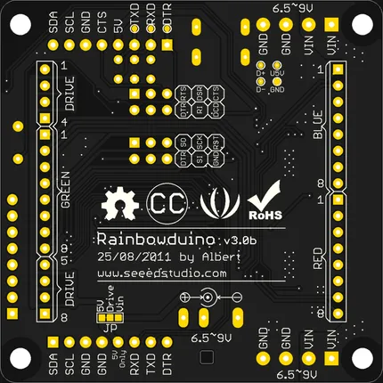

# Rainbowduino V3.0

**Seeed Studio** · Source collection

Revision: Unverified source identity  
Coverage: Source collection; review pending

[Browse all manufacturers](../../../../BROWSE.md) · [Desktop app](https://github.com/valleytechsolutions/black-wire-desktop)

## Hardware Overview (Bottom)

**source reference** · Unreviewed source · PNG

[Open original reference](../../../../library/media/2b9d2574046c7df5677d5a86104c9b73821599a7d7a2c1d71b7f2ac04ae0537e.png)

**Credit and rights:** Source rights not yet established. Source/manufacturer: Seeed Studio.

[Source 1](https://files.seeedstudio.com/wiki/Rainbowduino_v3.0/img/Rainbowduino_V3.0b_board_bottom.png) · [Source 2](https://wiki.seeedstudio.com/Rainbowduino_v3.0/)

Original source index: Hardware Overview (Bottom). This file is searchable but has not been promoted to a reviewed physical board pinout.

SHA-256: `2b9d2574046c7df5677d5a86104c9b73821599a7d7a2c1d71b7f2ac04ae0537e`

Pin assignments have not been independently electrically verified. Check board revision before wiring.
