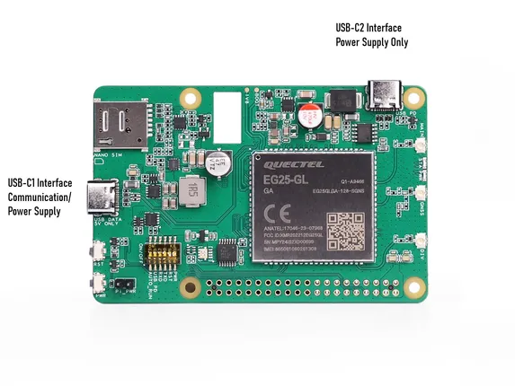
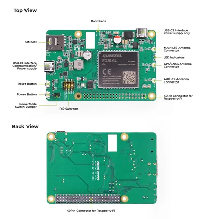

# Raspberry Pi 4G LTE HAT

**Seeed Studio** · Source collection

Revision: Unverified source identity  
Coverage: Source collection; review pending

[Browse all manufacturers](../../../../BROWSE.md) · [Desktop app](https://github.com/valleytechsolutions/black-wire-desktop)

## Hardware Overview (Ports)

**source reference** · Unreviewed source · JPG

[Open original reference](../../../../library/media/6e1ae08d67b4c0d96da9d4497c1989fae766c044407432be28fc84352da4c001.jpg)

**Credit and rights:** Source rights not yet established. Source/manufacturer: Seeed Studio.

[Source 1](https://files.seeedstudio.com/wiki/4g_hat_raspberry_pi_eg25_gl/usbcin.jpg) · [Source 2](https://wiki.seeedstudio.com/getting_started_raspberry_pi_4g_lte_hat/)

Original source index: Hardware Overview (Ports). This file is searchable but has not been promoted to a reviewed physical board pinout.

SHA-256: `6e1ae08d67b4c0d96da9d4497c1989fae766c044407432be28fc84352da4c001`

## Hardware Overview (Top & Back)

**source reference** · Unreviewed source · JPG

[Open original reference](../../../../library/media/24b7306fde4a1ee39d3795002f026d1675e36b78c1bc7b2c87114144c4448098.jpg)

**Credit and rights:** Source rights not yet established. Source/manufacturer: Seeed Studio.

[Source 1](https://files.seeedstudio.com/wiki/4g_hat_raspberry_pi_eg25_gl/overview.jpg) · [Source 2](https://wiki.seeedstudio.com/getting_started_raspberry_pi_4g_lte_hat/)

Original source index: Hardware Overview (Top & Back). This file is searchable but has not been promoted to a reviewed physical board pinout.

SHA-256: `24b7306fde4a1ee39d3795002f026d1675e36b78c1bc7b2c87114144c4448098`

Pin assignments have not been independently electrically verified. Check board revision before wiring.
