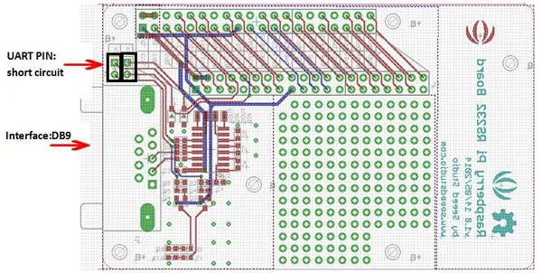

# Raspberry Pi RS232 Board V1.0

**Seeed Studio** · Source collection

Revision: Unverified source identity  
Coverage: Source collection; review pending

[Browse all manufacturers](../../../../BROWSE.md) · [Desktop app](https://github.com/valleytechsolutions/black-wire-desktop)

## Hardware Overview

**source reference** · Unreviewed source · JPG

[Open original reference](../../../../library/media/80b55acc2f9881e2ff8423a906dbeedc7ff6c19a694d8fe77267e34ae0288fa8.jpg)

**Credit and rights:** Source rights not yet established. Source/manufacturer: Seeed Studio.

[Source 1](https://files.seeedstudio.com/wiki/Raspberry_Pi_R232_Board_v1.0/img/Raspberry_Pi_RS232_Board_v1.0_p2.jpg) · [Source 2](https://wiki.seeedstudio.com/Raspberry_Pi_R232_Board_v1.0/)

Original source index: Hardware Overview. This file is searchable but has not been promoted to a reviewed physical board pinout.

SHA-256: `80b55acc2f9881e2ff8423a906dbeedc7ff6c19a694d8fe77267e34ae0288fa8`

Pin assignments have not been independently electrically verified. Check board revision before wiring.
