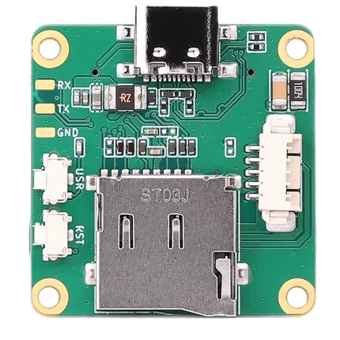
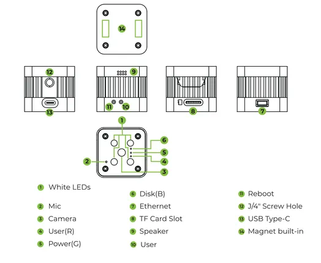

# reCamera 2002

**Seeed Studio** · Source collection

Revision: Unverified source identity  
Coverage: Source collection; review pending

[Browse all manufacturers](../../../../BROWSE.md) · [Devices & IoT](../../../../DEVICES.md) · [Open in the browser guide](https://valleytech-black-wire-guide.pages.dev/?board=source-board-0607bf62a8c1b08271)

Device category: **Cameras & audio**

## Hardware Overview (Top)

**source reference** · Unreviewed source · PNG

[Open original reference](../../../../library/media/18611ed68071e1e399126e05394f33879396b3c07777d2ba3cdf6813a59bf771.png)

**Credit and rights:** Source rights not yet established. Source/manufacturer: Seeed Studio.

[Source 1](https://files.seeedstudio.com/wiki/reCamera/B1_Default_Upper.png) · [Source 2](https://wiki.seeedstudio.com/recamera_2002_series_hardware_and_specs/)

Original source index: Hardware Overview (Top). This file is searchable but has not been promoted to a reviewed physical board pinout.

Image revision: Not identified

SHA-256: `18611ed68071e1e399126e05394f33879396b3c07777d2ba3cdf6813a59bf771`

## Hardware Overview

**source reference** · Unreviewed source · PNG

[Open original reference](../../../../library/media/5410b8a77d364a3b477f7c1d567137fc5d5f389d4a6fa4e0109755d7c1730320.png)

**Credit and rights:** Source rights not yet established. Source/manufacturer: Seeed Studio.

[Source 1](https://files.seeedstudio.com/wiki/reCamera/image-12.png) · [Source 2](https://wiki.seeedstudio.com/recamera_2002_series_hardware_and_specs/)

Original source index: Hardware Overview. This file is searchable but has not been promoted to a reviewed physical board pinout.

Image revision: Not identified

SHA-256: `5410b8a77d364a3b477f7c1d567137fc5d5f389d4a6fa4e0109755d7c1730320`

Pin assignments have not been independently electrically verified. Check board revision before wiring.
