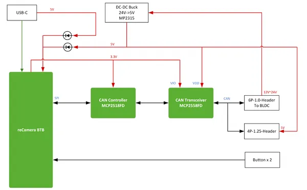
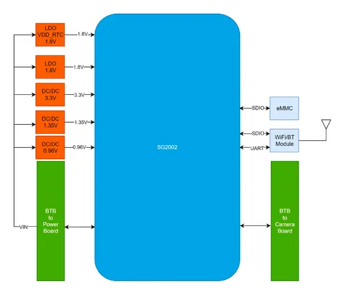
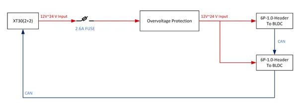
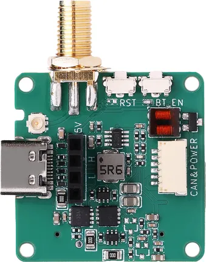
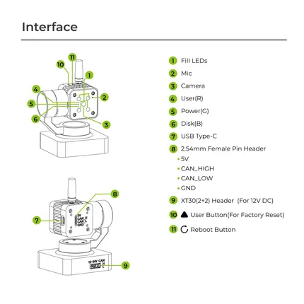

# reCamera Gimbal

**Seeed Studio** · Source collection

Revision: Unverified source identity  
Coverage: Source collection; review pending

[Browse all manufacturers](../../../../BROWSE.md) · [Desktop app](https://github.com/valleytechsolutions/black-wire-desktop)

## Block Diagram (Base Board B401)

**source reference** · Unreviewed source · PNG

[Open original reference](../../../../library/media/72cbf35819a05b181b51aebba3a2804f91295d7f8f79c6269f2130275f1ef183.png)

**Credit and rights:** Source rights not yet established. Source/manufacturer: Seeed Studio.

[Source 1](https://files.seeedstudio.com/wiki/reCamera/Gimbal/B401_block.png) · [Source 2](https://wiki.seeedstudio.com/recamera_gimbal_hardware_and_specs/)

Original source index: Block Diagram (Base Board B401). This file is searchable but has not been promoted to a reviewed physical board pinout.

SHA-256: `72cbf35819a05b181b51aebba3a2804f91295d7f8f79c6269f2130275f1ef183`

## Block Diagram (Core Board C101)

**source reference** · Unreviewed source · PNG

[Open original reference](../../../../library/media/be36c15abc8901de4bf18c81d6e400e61f3bb5cccfb867fcd7be196468011292.png)

**Credit and rights:** Source rights not yet established. Source/manufacturer: Seeed Studio.

[Source 1](https://files.seeedstudio.com/wiki/reCamera/Gimbal/C101_block.png) · [Source 2](https://wiki.seeedstudio.com/recamera_gimbal_hardware_and_specs/)

Original source index: Block Diagram (Core Board C101). This file is searchable but has not been promoted to a reviewed physical board pinout.

SHA-256: `be36c15abc8901de4bf18c81d6e400e61f3bb5cccfb867fcd7be196468011292`

## Block Diagram (Power Supply)

**source reference** · Unreviewed source · PNG

[Open original reference](../../../../library/media/0c3b6b3b576cec029554f134672d51703c2f3d7466046af6827aa762c24ed851.png)

**Credit and rights:** Source rights not yet established. Source/manufacturer: Seeed Studio.

[Source 1](https://files.seeedstudio.com/wiki/reCamera/Gimbal/power_supply_block.png) · [Source 2](https://wiki.seeedstudio.com/recamera_gimbal_hardware_and_specs/)

Original source index: Block Diagram (Power Supply). This file is searchable but has not been promoted to a reviewed physical board pinout.

SHA-256: `0c3b6b3b576cec029554f134672d51703c2f3d7466046af6827aa762c24ed851`

## Hardware Overview (Top)

**source reference** · Unreviewed source · PNG

[Open original reference](../../../../library/media/54ce56afa55c703ec417e4985ab29d7fd485312546d26b274ed818ee777828a2.png)

**Credit and rights:** Source rights not yet established. Source/manufacturer: Seeed Studio.

[Source 1](https://files.seeedstudio.com/wiki/reCamera/Gimbal/B401_Top.png) · [Source 2](https://wiki.seeedstudio.com/recamera_gimbal_hardware_and_specs/)

Original source index: Hardware Overview (Top). This file is searchable but has not been promoted to a reviewed physical board pinout.

SHA-256: `54ce56afa55c703ec417e4985ab29d7fd485312546d26b274ed818ee777828a2`

## Hardware Overview

**source reference** · Unreviewed source · PNG

[Open original reference](../../../../library/media/4dbad2d8f459e2402147ef99bb87bf27ec3c30eb627deba0c0c2468983901ae1.png)

**Credit and rights:** Source rights not yet established. Source/manufacturer: Seeed Studio.

[Source 1](https://files.seeedstudio.com/wiki/reCamera/Gimbal/Interface.png) · [Source 2](https://wiki.seeedstudio.com/recamera_gimbal_hardware_and_specs/)

Original source index: Hardware Overview. This file is searchable but has not been promoted to a reviewed physical board pinout.

SHA-256: `4dbad2d8f459e2402147ef99bb87bf27ec3c30eb627deba0c0c2468983901ae1`

Pin assignments have not been independently electrically verified. Check board revision before wiring.
