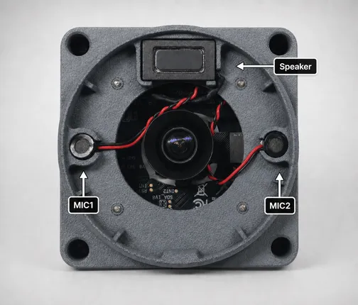
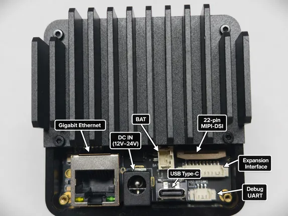

# reCamera Pro

**Seeed Studio** · Source collection

Revision: Unverified source identity  
Coverage: Source collection; review pending

[Browse all manufacturers](../../../../BROWSE.md) · [Devices & IoT](../../../../DEVICES.md) · [Open in the browser guide](https://valleytech-black-wire-guide.pages.dev/?board=source-board-97cd27180910ffb7e1)

Device category: **Cameras & audio**

## Hardware Overview (Inside)

**source reference** · Unreviewed source · PNG

[Open original reference](../../../../library/media/868e4b13156241f5d082150bb2667f38ba8f687ad8851df982d0843fdc827f8b.png)

**Credit and rights:** Source rights not yet established. Source/manufacturer: Seeed Studio.

[Source 1](https://files.seeedstudio.com/wiki/reCamera-Pro/getting_started/reCamera-PRO_Front_cover.png) · [Source 2](https://wiki.seeedstudio.com/recamera_pro_hardware_specifications/)

Original source index: Hardware Overview (Inside). This file is searchable but has not been promoted to a reviewed physical board pinout.

Image revision: Not identified

SHA-256: `868e4b13156241f5d082150bb2667f38ba8f687ad8851df982d0843fdc827f8b`

## Hardware Overview (Ports)

**source reference** · Unreviewed source · PNG

[Open original reference](../../../../library/media/de710f4c63b1f111ec7f5aa525ca2d2fcf854029235dc872ec8f8c49c5ff3055.png)

**Credit and rights:** Source rights not yet established. Source/manufacturer: Seeed Studio.

[Source 1](https://files.seeedstudio.com/wiki/reCamera-Pro/getting_started/base_board_pin.png) · [Source 2](https://wiki.seeedstudio.com/recamera_pro_hardware_specifications/)

Original source index: Hardware Overview (Ports). This file is searchable but has not been promoted to a reviewed physical board pinout.

Image revision: Not identified

SHA-256: `de710f4c63b1f111ec7f5aa525ca2d2fcf854029235dc872ec8f8c49c5ff3055`

Pin assignments have not been independently electrically verified. Check board revision before wiring.
