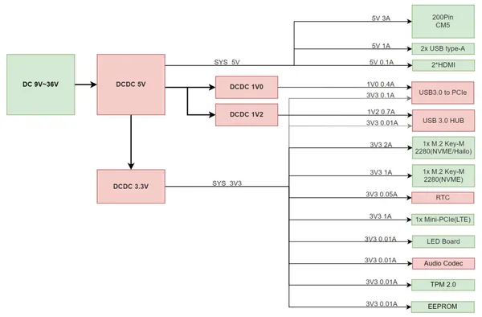
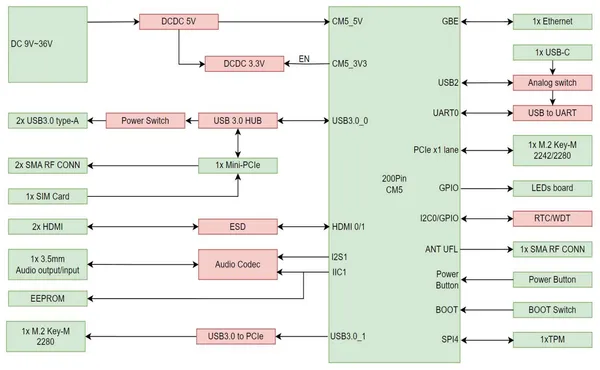
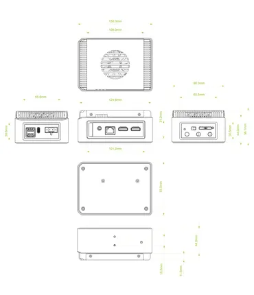
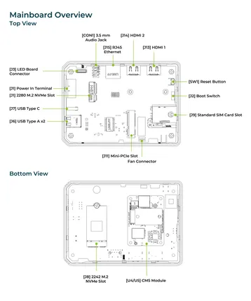
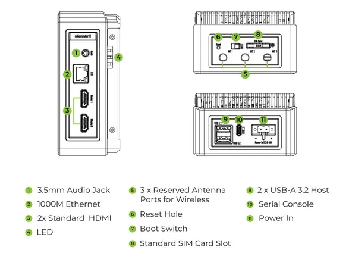

# reComputer AI Industrial R2135

**Seeed Studio** · Source collection

Revision: Unverified source identity  
Coverage: Source collection; review pending

[Browse all manufacturers](../../../../BROWSE.md) · [Desktop app](https://github.com/valleytechsolutions/black-wire-desktop)

## Block Diagram (Power)

**source reference** · Unreviewed source · PNG

[Open original reference](../../../../library/media/3acd114c286ff2a310b765c6668f849c4e567e8a1fecf0a10a280b46b7969170.png)

**Credit and rights:** Source rights not yet established. Source/manufacturer: Seeed Studio.

[Source 1](https://files.seeedstudio.com/wiki/reComputer-AI-Industrial/reComputer_AI_Industrial_power_diagram.png) · [Source 2](https://wiki.seeedstudio.com/recomputer_ai_industrial_r2135_getting_start/)

Original source index: Block Diagram (Power). This file is searchable but has not been promoted to a reviewed physical board pinout.

SHA-256: `3acd114c286ff2a310b765c6668f849c4e567e8a1fecf0a10a280b46b7969170`

## Block Diagram

**source reference** · Unreviewed source · PNG

[Open original reference](../../../../library/media/685f4deab38b79986619573355d508234b608da8614bbe103a3e5a4cdcf86e5c.png)

**Credit and rights:** Source rights not yet established. Source/manufacturer: Seeed Studio.

[Source 1](https://files.seeedstudio.com/wiki/reComputer-AI-Industrial/reComputer_AI_Industrial_block_diagram.png) · [Source 2](https://wiki.seeedstudio.com/recomputer_ai_industrial_r2135_getting_start/)

Original source index: Block Diagram. This file is searchable but has not been promoted to a reviewed physical board pinout.

SHA-256: `685f4deab38b79986619573355d508234b608da8614bbe103a3e5a4cdcf86e5c`

## Dimensions

**source reference** · Unreviewed source · JPG

[Open original reference](../../../../library/media/49713006d261199ffc06a4edac5b027f44c58c80943817177a3c7d9ced915d26.jpg)

**Credit and rights:** Source rights not yet established. Source/manufacturer: Seeed Studio.

[Source 1](https://files.seeedstudio.com/wiki/reComputer-AI-Industrial/reComputer_AI_industrial_dimension.jpeg) · [Source 2](https://wiki.seeedstudio.com/recomputer_ai_industrial_r2135_getting_start/)

Original source index: Dimensions. This file is searchable but has not been promoted to a reviewed physical board pinout.

SHA-256: `49713006d261199ffc06a4edac5b027f44c58c80943817177a3c7d9ced915d26`

## Hardware Overview (Inside)

**source reference** · Unreviewed source · JPG

[Open original reference](../../../../library/media/f461e1075624ba60dc2f99c2166dda3228f791ffe508498d44f4c1695182b31b.jpg)

**Credit and rights:** Source rights not yet established. Source/manufacturer: Seeed Studio.

[Source 1](https://files.seeedstudio.com/wiki/reComputer-AI-Industrial/reComputer_AI_Industrial_Mainboard.jpeg) · [Source 2](https://wiki.seeedstudio.com/recomputer_ai_industrial_r2135_getting_start/)

Original source index: Hardware Overview (Inside). This file is searchable but has not been promoted to a reviewed physical board pinout.

SHA-256: `f461e1075624ba60dc2f99c2166dda3228f791ffe508498d44f4c1695182b31b`

## Hardware Overview

**source reference** · Unreviewed source · JPG

[Open original reference](../../../../library/media/6be93cf0ff0520754802b2c1e26cf068f38c31e524be579204cc2f568929baed.jpg)

**Credit and rights:** Source rights not yet established. Source/manufacturer: Seeed Studio.

[Source 1](https://media-cdn.seeedstudio.com/media/wysiwyg/upload/image-recomputer.png) · [Source 2](https://wiki.seeedstudio.com/recomputer_ai_industrial_r2135_getting_start/)

Original source index: Hardware Overview. This file is searchable but has not been promoted to a reviewed physical board pinout.

SHA-256: `6be93cf0ff0520754802b2c1e26cf068f38c31e524be579204cc2f568929baed`

Pin assignments have not been independently electrically verified. Check board revision before wiring.
