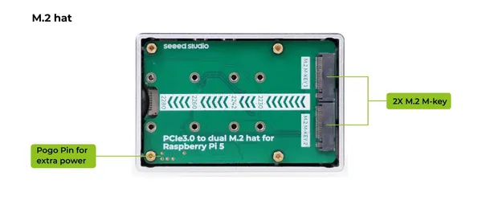
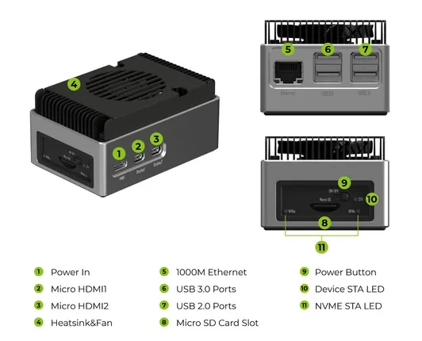

# reComputer AI R2000 Series

**Seeed Studio** · Source collection

Revision: Unverified source identity  
Coverage: Source collection; review pending

[Browse all manufacturers](../../../../BROWSE.md) · [Desktop app](https://github.com/valleytechsolutions/black-wire-desktop)

## Hardware Overview (M.2 HAT)

**source reference** · Unreviewed source · JPG

[Open original reference](../../../../library/media/227bee702a6cd13e657d0ec53164c56b9cab8fb75e3837559587b00a544fd7fe.jpg)

**Credit and rights:** Source rights not yet established. Source/manufacturer: Seeed Studio.

Original source index: Hardware Overview (M.2 HAT). This file is searchable but has not been promoted to a reviewed physical board pinout.

SHA-256: `227bee702a6cd13e657d0ec53164c56b9cab8fb75e3837559587b00a544fd7fe`

## Hardware Overview

**source reference** · Unreviewed source · JPG

[Open original reference](../../../../library/media/90614168bde89b7fe4fbecb5e9bf1cfb9fd6c1fe2ddd9160d3a821fec776badd.jpg)

**Credit and rights:** Source rights not yet established. Source/manufacturer: Seeed Studio.

Original source index: Hardware Overview. This file is searchable but has not been promoted to a reviewed physical board pinout.

SHA-256: `90614168bde89b7fe4fbecb5e9bf1cfb9fd6c1fe2ddd9160d3a821fec776badd`

Pin assignments have not been independently electrically verified. Check board revision before wiring.
