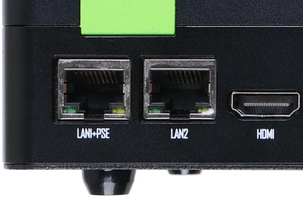
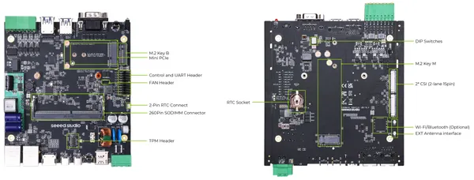

# reComputer Industrial J2011

**Seeed Studio** · Source collection

Revision: Unverified source identity  
Coverage: Source collection; review pending

[Browse all manufacturers](../../../../BROWSE.md) · [Desktop app](https://github.com/valleytechsolutions/black-wire-desktop)

## Hardware Overview (Ports)

**source reference** · Unreviewed source · PNG

[Open original reference](../../../../library/media/29ed06a86870f5cbb2b973e5d9411e9d72c21c09becaa06b4b2a68e780e1061c.png)

**Credit and rights:** Source rights not yet established. Source/manufacturer: Seeed Studio.

[Source 1](https://files.seeedstudio.com/wiki/reComputer-Industrial/36.png) · [Source 2](https://wiki.seeedstudio.com/reComputer_Industrial_J20_Hardware_Interfaces_Usage/)

Original source index: Hardware Overview (Ports). This file is searchable but has not been promoted to a reviewed physical board pinout.

SHA-256: `29ed06a86870f5cbb2b973e5d9411e9d72c21c09becaa06b4b2a68e780e1061c`

## Hardware Overview (Top)

**source reference** · Unreviewed source · JPG

[Open original reference](../../../../library/media/76953265c758ed44001879e538fe850c024401b2311c9fa3598a5c213a57ea1d.jpg)

**Credit and rights:** Source rights not yet established. Source/manufacturer: Seeed Studio.

[Source 1](https://files.seeedstudio.com/wiki/reComputer-Industrial/4.jpg) · [Source 2](https://wiki.seeedstudio.com/reComputer_Industrial_Getting_Started/)

Original source index: Hardware Overview (Top). This file is searchable but has not been promoted to a reviewed physical board pinout.

SHA-256: `76953265c758ed44001879e538fe850c024401b2311c9fa3598a5c213a57ea1d`

Pin assignments have not been independently electrically verified. Check board revision before wiring.
