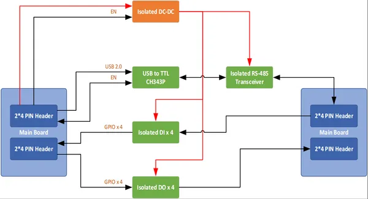
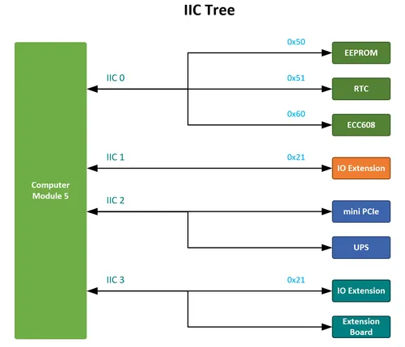
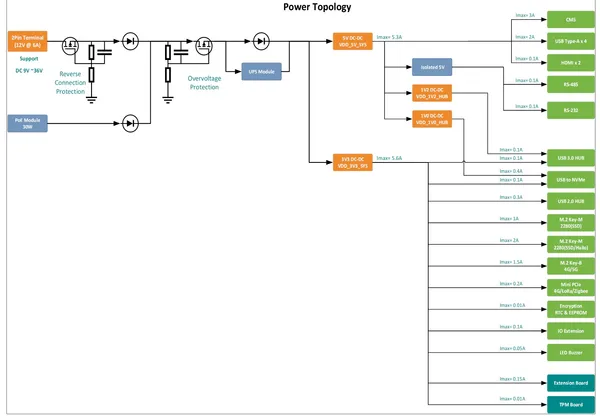
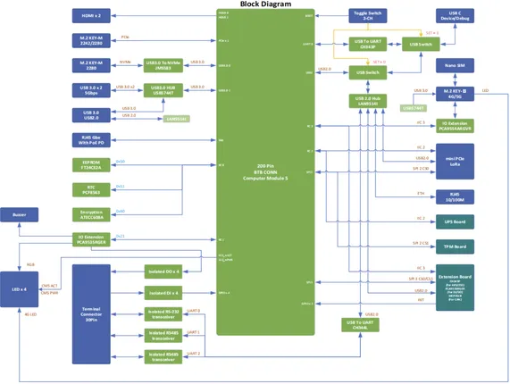
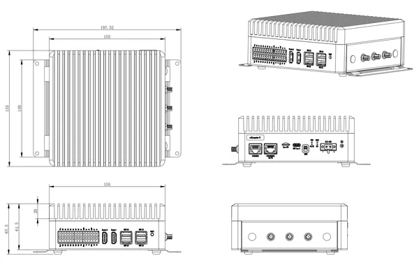
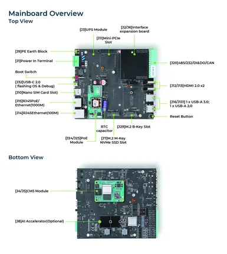
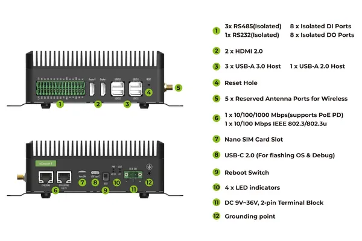
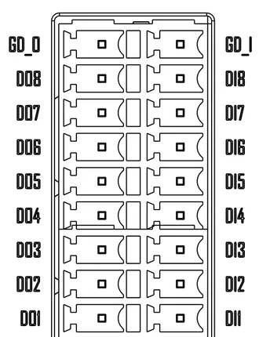
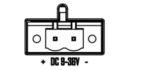
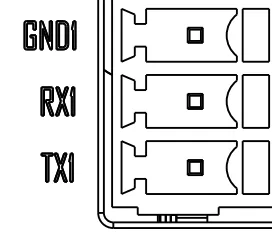

# reComputer Industrial R20xx

**Seeed Studio** · Source collection

Revision: Unverified source identity  
Coverage: Source collection; review pending

[Browse all manufacturers](../../../../BROWSE.md) · [Desktop app](https://github.com/valleytechsolutions/black-wire-desktop)

## Block Diagram (I-O Board)

**source reference** · Unreviewed source · PNG

[Open original reference](../../../../library/media/121fa57cf10125bc7d52a703c7fa4a441e58b8823cdafe3963ec3ce1a41beebf.png)

**Credit and rights:** Source rights not yet established. Source/manufacturer: Seeed Studio.

Original source index: Block Diagram (I-O Board). This file is searchable but has not been promoted to a reviewed physical board pinout.

SHA-256: `121fa57cf10125bc7d52a703c7fa4a441e58b8823cdafe3963ec3ce1a41beebf`

## Block Diagram (I2C Tree)

**source reference** · Unreviewed source · PNG

[Open original reference](../../../../library/media/ab416588a43b80e90be78eda83e06f3cabce02be0256a6e0c36c081d91d717f9.png)

**Credit and rights:** Source rights not yet established. Source/manufacturer: Seeed Studio.

Original source index: Block Diagram (I2C Tree). This file is searchable but has not been promoted to a reviewed physical board pinout.

SHA-256: `ab416588a43b80e90be78eda83e06f3cabce02be0256a6e0c36c081d91d717f9`

## Block Diagram (Power)

**source reference** · Unreviewed source · PNG

[Open original reference](../../../../library/media/496d457225a1cf878bec14ec849490a78e3f356ef1de71fce53eb4742d763837.png)

**Credit and rights:** Source rights not yet established. Source/manufacturer: Seeed Studio.

Original source index: Block Diagram (Power). This file is searchable but has not been promoted to a reviewed physical board pinout.

SHA-256: `496d457225a1cf878bec14ec849490a78e3f356ef1de71fce53eb4742d763837`

## Block Diagram

**source reference** · Unreviewed source · PNG

[Open original reference](../../../../library/media/fd685216f61efac11529b754c960b5bd42720368a5ad606f258d3fb7301c2b29.png)

**Credit and rights:** Source rights not yet established. Source/manufacturer: Seeed Studio.

Original source index: Block Diagram. This file is searchable but has not been promoted to a reviewed physical board pinout.

SHA-256: `fd685216f61efac11529b754c960b5bd42720368a5ad606f258d3fb7301c2b29`

## Dimensions

**source reference** · Unreviewed source · PNG

[Open original reference](../../../../library/media/09eb870a2ad1ccc7343aa3f1af8aecffcb6bfd4889e8f52ddc629eac3a7bb1ec.png)

**Credit and rights:** Source rights not yet established. Source/manufacturer: Seeed Studio.

Original source index: Dimensions. This file is searchable but has not been promoted to a reviewed physical board pinout.

SHA-256: `09eb870a2ad1ccc7343aa3f1af8aecffcb6bfd4889e8f52ddc629eac3a7bb1ec`

## Hardware Overview (Inside)

**source reference** · Unreviewed source · PNG

[Open original reference](../../../../library/media/8ad871a0335ca52d687ec71807cd175f1a7c75c8f7f371f93aca101c7a5e1b00.png)

**Credit and rights:** Source rights not yet established. Source/manufacturer: Seeed Studio.

Original source index: Hardware Overview (Inside). This file is searchable but has not been promoted to a reviewed physical board pinout.

SHA-256: `8ad871a0335ca52d687ec71807cd175f1a7c75c8f7f371f93aca101c7a5e1b00`

## Hardware Overview

**source reference** · Unreviewed source · PNG

[Open original reference](../../../../library/media/9addfa35445605cdfcc34956d132325389eb349351d995eb3b5aa698baa64f4e.png)

**Credit and rights:** Source rights not yet established. Source/manufacturer: Seeed Studio.

Original source index: Hardware Overview. This file is searchable but has not been promoted to a reviewed physical board pinout.

SHA-256: `9addfa35445605cdfcc34956d132325389eb349351d995eb3b5aa698baa64f4e`

## Pin Definition (DI-DO)

**source reference** · Unreviewed source · PNG

[Open original reference](../../../../library/media/96d28153bfc093a59275d3a2f6fff88ede54d458edf56cf6d258b5bc037dd406.png)

**Credit and rights:** Source rights not yet established. Source/manufacturer: Seeed Studio.

[Source 1](https://files.seeedstudio.com/wiki/reComputer-AI-Industrial/R2000/DO_INTRODUCION_20.png) · [Source 2](https://wiki.seeedstudio.com/recomputer_industrial_r20xx_getting_start/)

Original source index: Pin Definition (DI-DO). This file is searchable but has not been promoted to a reviewed physical board pinout.

SHA-256: `96d28153bfc093a59275d3a2f6fff88ede54d458edf56cf6d258b5bc037dd406`

## Pin Definition (Power Terminal)

**source reference** · Unreviewed source · PNG

[Open original reference](../../../../library/media/958935e0b8065c27b175860c742f695429e2a03801f113d76dff5f879e1aaafe.png)

**Credit and rights:** Source rights not yet established. Source/manufacturer: Seeed Studio.

Original source index: Pin Definition (Power Terminal). This file is searchable but has not been promoted to a reviewed physical board pinout.

SHA-256: `958935e0b8065c27b175860c742f695429e2a03801f113d76dff5f879e1aaafe`

## Pin Definition (RS232)

**source reference** · Unreviewed source · PNG

[Open original reference](../../../../library/media/cd3a58393273891c2cdba530579521b4412fbac2c773631fccabe61298852173.png)

**Credit and rights:** Source rights not yet established. Source/manufacturer: Seeed Studio.

[Source 1](https://files.seeedstudio.com/wiki/reComputer-AI-Industrial/R2000/232_introduction_1.png) · [Source 2](https://wiki.seeedstudio.com/recomputer_industrial_r20xx_getting_start/)

Original source index: Pin Definition (RS232). This file is searchable but has not been promoted to a reviewed physical board pinout.

SHA-256: `cd3a58393273891c2cdba530579521b4412fbac2c773631fccabe61298852173`

Pin assignments have not been independently electrically verified. Check board revision before wiring.
