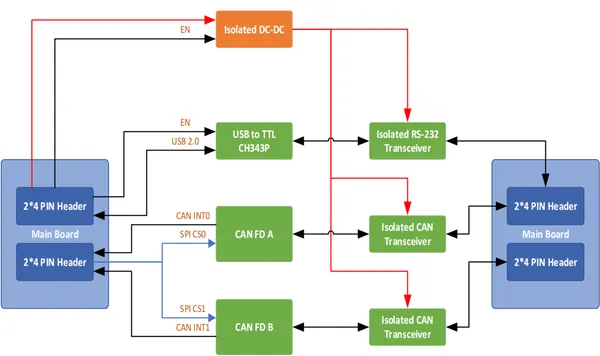
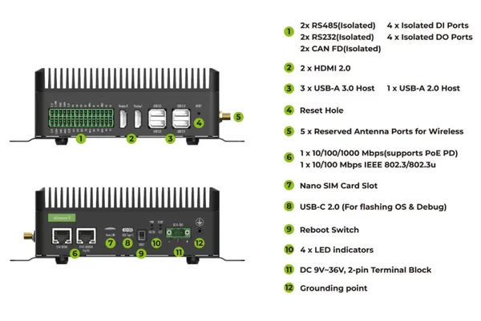
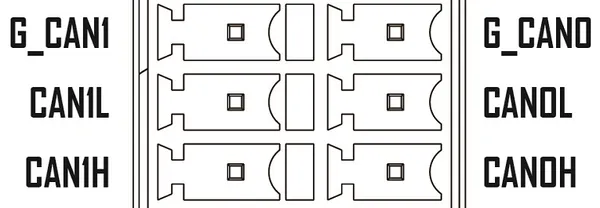

# reComputer Industrial R21xx

**Seeed Studio** · Source collection

Revision: Unverified source identity  
Coverage: Source collection; review pending

[Browse all manufacturers](../../../../BROWSE.md) · [Desktop app](https://github.com/valleytechsolutions/black-wire-desktop)

## Block Diagram (I-O Board)

**source reference** · Unreviewed source · PNG

[Open original reference](../../../../library/media/38ddb3e115e38947cc40b86aa379b234a4e601bb8293490d0cd7683b70fec454.png)

**Credit and rights:** Source rights not yet established. Source/manufacturer: Seeed Studio.

Original source index: Block Diagram (I-O Board). This file is searchable but has not been promoted to a reviewed physical board pinout.

SHA-256: `38ddb3e115e38947cc40b86aa379b234a4e601bb8293490d0cd7683b70fec454`

## Hardware Overview

**source reference** · Unreviewed source · PNG

[Open original reference](../../../../library/media/eaf60d0b490ccc5872490ed7caa73aa0b9699337d3258ceb887d98c4a8aeeceb.png)

**Credit and rights:** Source rights not yet established. Source/manufacturer: Seeed Studio.

Original source index: Hardware Overview. This file is searchable but has not been promoted to a reviewed physical board pinout.

SHA-256: `eaf60d0b490ccc5872490ed7caa73aa0b9699337d3258ceb887d98c4a8aeeceb`

## Pin Definition (CAN)

**source reference** · Unreviewed source · PNG

[Open original reference](../../../../library/media/a75ea0d41b2362c406f6ec426daea4b77510dc5e513ec3f2b3e7713fc214785c.png)

**Credit and rights:** Source rights not yet established. Source/manufacturer: Seeed Studio.

Original source index: Pin Definition (CAN). This file is searchable but has not been promoted to a reviewed physical board pinout.

SHA-256: `a75ea0d41b2362c406f6ec426daea4b77510dc5e513ec3f2b3e7713fc214785c`

Pin assignments have not been independently electrically verified. Check board revision before wiring.
