# reComputer Industrial R22xx

**Seeed Studio** · Source collection

Revision: Unverified source identity  
Coverage: Source collection; review pending

[Browse all manufacturers](../../../../BROWSE.md) · [Desktop app](https://github.com/valleytechsolutions/black-wire-desktop)

## Block Diagram (I-O)

**source reference** · Unreviewed source · PNG

[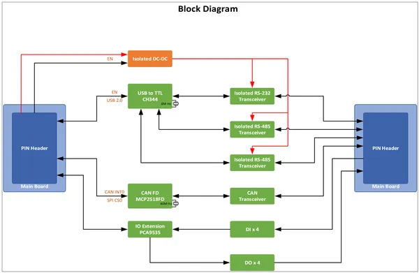](../../../../library/media/ca5d63401da720a2aa0d5a36bdbca3be6c95f410c978c09c896d14567def79c2.png)

[Open original reference](../../../../library/media/ca5d63401da720a2aa0d5a36bdbca3be6c95f410c978c09c896d14567def79c2.png)

**Credit and rights:** Source rights not yet established. Source/manufacturer: Seeed Studio.

Original source index: Block Diagram (I-O). This file is searchable but has not been promoted to a reviewed physical board pinout.

SHA-256: `ca5d63401da720a2aa0d5a36bdbca3be6c95f410c978c09c896d14567def79c2`

## Block Diagram (Power)

**source reference** · Unreviewed source · PNG

[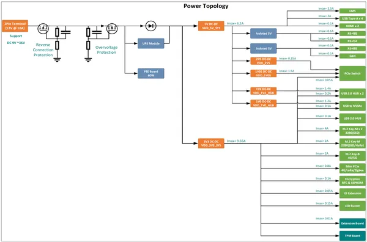](../../../../library/media/675f8c059d00f85bd8f9803f79127269d4b495298881a3408021db4c18e02a04.png)

[Open original reference](../../../../library/media/675f8c059d00f85bd8f9803f79127269d4b495298881a3408021db4c18e02a04.png)

**Credit and rights:** Source rights not yet established. Source/manufacturer: Seeed Studio.

Original source index: Block Diagram (Power). This file is searchable but has not been promoted to a reviewed physical board pinout.

SHA-256: `675f8c059d00f85bd8f9803f79127269d4b495298881a3408021db4c18e02a04`

## Block Diagram

**source reference** · Unreviewed source · PNG

[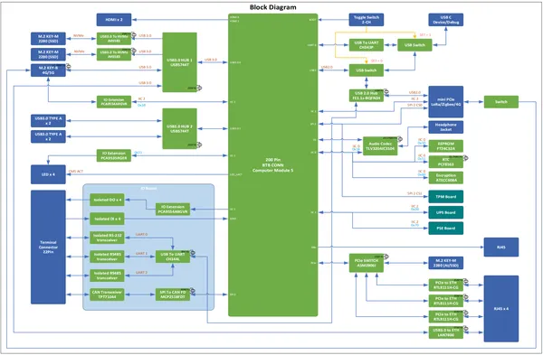](../../../../library/media/9131e0bea60b161d5382e9216f5d3528b75bf7dc8c1f63ae30836e1e91850fff.png)

[Open original reference](../../../../library/media/9131e0bea60b161d5382e9216f5d3528b75bf7dc8c1f63ae30836e1e91850fff.png)

**Credit and rights:** Source rights not yet established. Source/manufacturer: Seeed Studio.

Original source index: Block Diagram. This file is searchable but has not been promoted to a reviewed physical board pinout.

SHA-256: `9131e0bea60b161d5382e9216f5d3528b75bf7dc8c1f63ae30836e1e91850fff`

## Dimensions

**source reference** · Unreviewed source · PNG

[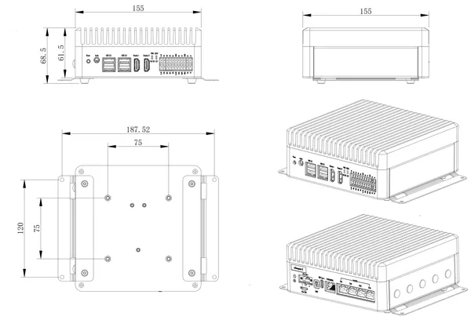](../../../../library/media/5aaadc79fc09f1b6126282d303570ec5600867aaae020888dff5613273771be0.png)

[Open original reference](../../../../library/media/5aaadc79fc09f1b6126282d303570ec5600867aaae020888dff5613273771be0.png)

**Credit and rights:** Source rights not yet established. Source/manufacturer: Seeed Studio.

Original source index: Dimensions. This file is searchable but has not been promoted to a reviewed physical board pinout.

SHA-256: `5aaadc79fc09f1b6126282d303570ec5600867aaae020888dff5613273771be0`

## Hardware Overview 2

**source reference** · Unreviewed source · PNG

[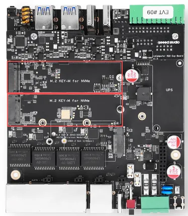](../../../../library/media/c66dd21c44daa3251697d3211d3b9891f8148378d5a079dcd7d7447b2f507f54.png)

[Open original reference](../../../../library/media/c66dd21c44daa3251697d3211d3b9891f8148378d5a079dcd7d7447b2f507f54.png)

**Credit and rights:** Source rights not yet established. Source/manufacturer: Seeed Studio.

Original source index: Hardware Overview 2. This file is searchable but has not been promoted to a reviewed physical board pinout.

SHA-256: `c66dd21c44daa3251697d3211d3b9891f8148378d5a079dcd7d7447b2f507f54`

## Hardware Overview 3

**source reference** · Unreviewed source · PNG

[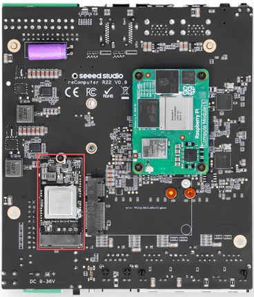](../../../../library/media/a241ae1b127d091d409ae923957f4b6e23491eb03bc37e75e518a2bb3570e3e7.png)

[Open original reference](../../../../library/media/a241ae1b127d091d409ae923957f4b6e23491eb03bc37e75e518a2bb3570e3e7.png)

**Credit and rights:** Source rights not yet established. Source/manufacturer: Seeed Studio.

Original source index: Hardware Overview 3. This file is searchable but has not been promoted to a reviewed physical board pinout.

SHA-256: `a241ae1b127d091d409ae923957f4b6e23491eb03bc37e75e518a2bb3570e3e7`

## Hardware Overview 4

**source reference** · Unreviewed source · PNG

[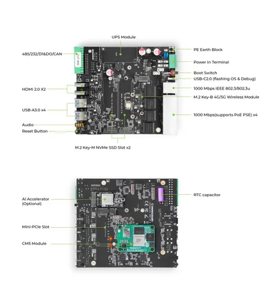](../../../../library/media/7e5aa08b020898497fda5846690afe37e434f361d6994ca14f19de2ee9e80e38.png)

[Open original reference](../../../../library/media/7e5aa08b020898497fda5846690afe37e434f361d6994ca14f19de2ee9e80e38.png)

**Credit and rights:** Source rights not yet established. Source/manufacturer: Seeed Studio.

Original source index: Hardware Overview 4. This file is searchable but has not been promoted to a reviewed physical board pinout.

SHA-256: `7e5aa08b020898497fda5846690afe37e434f361d6994ca14f19de2ee9e80e38`

## Hardware Overview

**source reference** · Unreviewed source · PNG

[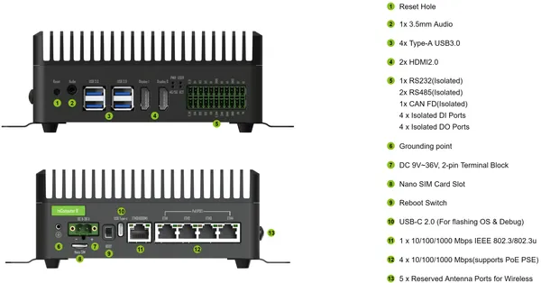](../../../../library/media/2ed99ab226d9a681bd5336e64be99cc099de2ade0e530f998cf46d03e7c2392f.png)

[Open original reference](../../../../library/media/2ed99ab226d9a681bd5336e64be99cc099de2ade0e530f998cf46d03e7c2392f.png)

**Credit and rights:** Source rights not yet established. Source/manufacturer: Seeed Studio.

Original source index: Hardware Overview. This file is searchable but has not been promoted to a reviewed physical board pinout.

SHA-256: `2ed99ab226d9a681bd5336e64be99cc099de2ade0e530f998cf46d03e7c2392f`

## Pin Definition Table 2

**source reference** · Unreviewed source · PNG

[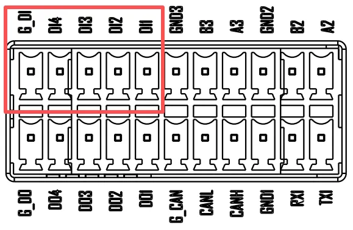](../../../../library/media/9f5595b9cba84d38506aadbb215ec9962b34ee053174e8dbb0ef60081d138fa0.png)

[Open original reference](../../../../library/media/9f5595b9cba84d38506aadbb215ec9962b34ee053174e8dbb0ef60081d138fa0.png)

**Credit and rights:** Source rights not yet established. Source/manufacturer: Seeed Studio.

Original source index: Pin Definition Table 2. This file is searchable but has not been promoted to a reviewed physical board pinout.

SHA-256: `9f5595b9cba84d38506aadbb215ec9962b34ee053174e8dbb0ef60081d138fa0`

## Pin Definition Table 3

**source reference** · Unreviewed source · PNG

[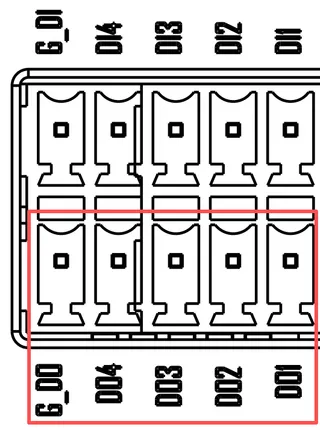](../../../../library/media/7fae5f1f3ac80bec0d27bd7f6f0fa7ad9bec6e4f3bcc66c78da9d847fb890cfe.png)

[Open original reference](../../../../library/media/7fae5f1f3ac80bec0d27bd7f6f0fa7ad9bec6e4f3bcc66c78da9d847fb890cfe.png)

**Credit and rights:** Source rights not yet established. Source/manufacturer: Seeed Studio.

Original source index: Pin Definition Table 3. This file is searchable but has not been promoted to a reviewed physical board pinout.

SHA-256: `7fae5f1f3ac80bec0d27bd7f6f0fa7ad9bec6e4f3bcc66c78da9d847fb890cfe`

## Pin Definition Table 4

**source reference** · Unreviewed source · PNG

[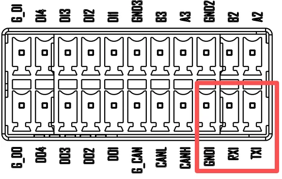](../../../../library/media/72dfe2c7d9f6b1844de4712c718e22f7f99a8d9e5d1b81654d9a3e7cff77ff4f.png)

[Open original reference](../../../../library/media/72dfe2c7d9f6b1844de4712c718e22f7f99a8d9e5d1b81654d9a3e7cff77ff4f.png)

**Credit and rights:** Source rights not yet established. Source/manufacturer: Seeed Studio.

Original source index: Pin Definition Table 4. This file is searchable but has not been promoted to a reviewed physical board pinout.

SHA-256: `72dfe2c7d9f6b1844de4712c718e22f7f99a8d9e5d1b81654d9a3e7cff77ff4f`

## Pin Definition Table 5

**source reference** · Unreviewed source · PNG

[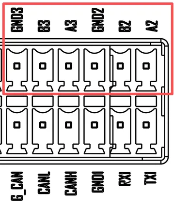](../../../../library/media/e014b98a88897e74fce559e87786b896a35085dbd66a2b1e58924c8e1fd454b5.png)

[Open original reference](../../../../library/media/e014b98a88897e74fce559e87786b896a35085dbd66a2b1e58924c8e1fd454b5.png)

**Credit and rights:** Source rights not yet established. Source/manufacturer: Seeed Studio.

Original source index: Pin Definition Table 5. This file is searchable but has not been promoted to a reviewed physical board pinout.

SHA-256: `e014b98a88897e74fce559e87786b896a35085dbd66a2b1e58924c8e1fd454b5`

## Pin Definition Table

**source reference** · Unreviewed source · PNG

[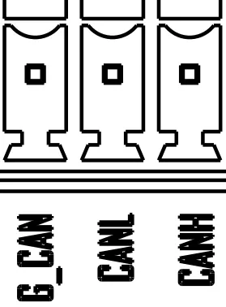](../../../../library/media/9ba773a8e25d51d54dee05c2bc8b1230d660e06180d70cec8f8bd9184dd0b038.png)

[Open original reference](../../../../library/media/9ba773a8e25d51d54dee05c2bc8b1230d660e06180d70cec8f8bd9184dd0b038.png)

**Credit and rights:** Source rights not yet established. Source/manufacturer: Seeed Studio.

Original source index: Pin Definition Table. This file is searchable but has not been promoted to a reviewed physical board pinout.

SHA-256: `9ba773a8e25d51d54dee05c2bc8b1230d660e06180d70cec8f8bd9184dd0b038`

Pin assignments have not been independently electrically verified. Check board revision before wiring.
