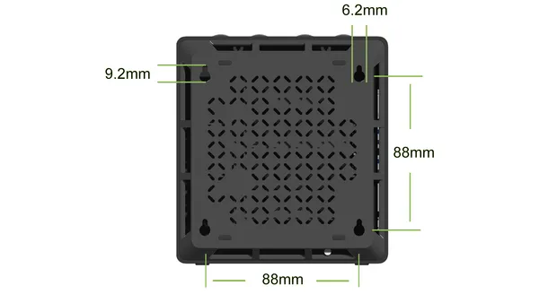
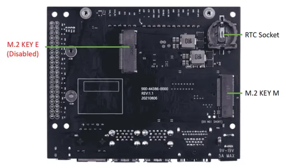
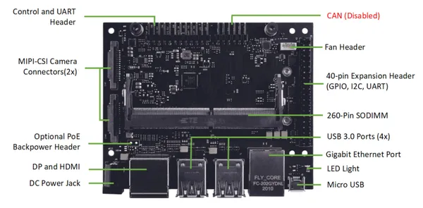
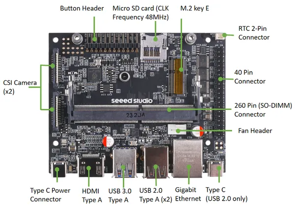

# reComputer J1010

**Seeed Studio** · Source collection

Revision: Unverified source identity  
Coverage: Source collection; review pending

[Browse all manufacturers](../../../../BROWSE.md) · [Desktop app](https://github.com/valleytechsolutions/black-wire-desktop)

## Dimensions

**source reference** · Unreviewed source · PNG

[Open original reference](../../../../library/media/48ebd9500561a598a4a471ebf347dc2e9b283ccfe3d70101717ed66c64e63697.png)

**Credit and rights:** Source rights not yet established. Source/manufacturer: Seeed Studio.

[Source 1](https://files.seeedstudio.com/wiki/reComputer-Jetson-Nano/Jetsonbackspec2.png) · [Source 2](https://wiki.seeedstudio.com/reComputer_Jetson_Series_Hardware_Layout/)

Original source index: Dimensions. This file is searchable but has not been promoted to a reviewed physical board pinout.

SHA-256: `48ebd9500561a598a4a471ebf347dc2e9b283ccfe3d70101717ed66c64e63697`

## Hardware Overview (Back)

**source reference** · Unreviewed source · JPG

[Open original reference](../../../../library/media/32907461322f67a5499cc5ad4a04ea080ad32b191a622b32ea06eea2baa79f32.jpg)

**Credit and rights:** Source rights not yet established. Source/manufacturer: Seeed Studio.

[Source 1](https://files.seeedstudio.com/wiki/recomputer-Jetson-20-1-H1/Jetsonh01carriedboards.jpg) · [Source 2](https://wiki.seeedstudio.com/reComputer_Jetson_Series_Hardware_Layout/)

Original source index: Hardware Overview (Back). This file is searchable but has not been promoted to a reviewed physical board pinout.

SHA-256: `32907461322f67a5499cc5ad4a04ea080ad32b191a622b32ea06eea2baa79f32`

## Hardware Overview (Front)

**source reference** · Unreviewed source · JPG

[Open original reference](../../../../library/media/a5d7b2386218caae7b65b1eabf0db4e0422de217baee978830fb3b230987380d.jpg)

**Credit and rights:** Source rights not yet established. Source/manufacturer: Seeed Studio.

[Source 1](https://files.seeedstudio.com/wiki/recomputer-Jetson-20-1-H1/Jetsonh01carriedboard.jpg) · [Source 2](https://wiki.seeedstudio.com/reComputer_Jetson_Series_Hardware_Layout/)

Original source index: Hardware Overview (Front). This file is searchable but has not been promoted to a reviewed physical board pinout.

SHA-256: `a5d7b2386218caae7b65b1eabf0db4e0422de217baee978830fb3b230987380d`

## Hardware Overview (Front)

**source reference** · Unreviewed source · PNG

[Open original reference](../../../../library/media/1cbd7cc1438ee61e16b711538db327eae23cea5bcbd1b155225c29dc4b24583a.png)

**Credit and rights:** Source rights not yet established. Source/manufacturer: Seeed Studio.

[Source 1](https://files.seeedstudio.com/wiki/reComputer/reComputerJ101v2.png) · [Source 2](https://wiki.seeedstudio.com/reComputer_Jetson_Series_Hardware_Layout/)

Original source index: Hardware Overview (Front). This file is searchable but has not been promoted to a reviewed physical board pinout.

SHA-256: `1cbd7cc1438ee61e16b711538db327eae23cea5bcbd1b155225c29dc4b24583a`

Pin assignments have not been independently electrically verified. Check board revision before wiring.
