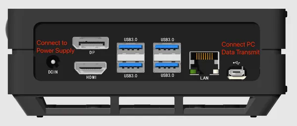

# reComputer J1020 V1

**Seeed Studio** · Source collection

Revision: Unverified source identity  
Coverage: Source collection; review pending

[Browse all manufacturers](../../../../BROWSE.md) · [Desktop app](https://github.com/valleytechsolutions/black-wire-desktop)

## Hardware Overview (Back)

**source reference** · Unreviewed source · PNG

[Open original reference](../../../../library/media/d25f2d049cc6b3e120fd20ec2a242e7d555ba76735269776cc6cac55704df0dc.png)

**Credit and rights:** Source rights not yet established. Source/manufacturer: Seeed Studio.

[Source 1](https://files.seeedstudio.com/wiki/reComputer_flash_system/reComputerJ2021_J202_Flash_Jetpack.png) · [Source 2](https://wiki.seeedstudio.com/reComputer_J1020_A206_Flash_JetPack/)

Original source index: Hardware Overview (Back). This file is searchable but has not been promoted to a reviewed physical board pinout.

SHA-256: `d25f2d049cc6b3e120fd20ec2a242e7d555ba76735269776cc6cac55704df0dc`

Pin assignments have not been independently electrically verified. Check board revision before wiring.
