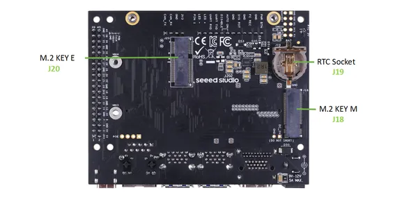
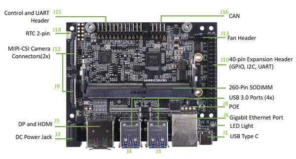

# reComputer J1020 V2

**Seeed Studio** · Source collection

Revision: Unverified source identity  
Coverage: Source collection; review pending

[Browse all manufacturers](../../../../BROWSE.md) · [Desktop app](https://github.com/valleytechsolutions/black-wire-desktop)

## Hardware Overview (Back)

**source reference** · Unreviewed source · PNG

[Open original reference](../../../../library/media/f4cf988a88b0bdffa8f483ea4b3fc9e428510e5b1bcd71bd54991918a1fd0dc0.png)

**Credit and rights:** Source rights not yet established. Source/manufacturer: Seeed Studio.

Original source index: Hardware Overview (Back). This file is searchable but has not been promoted to a reviewed physical board pinout.

SHA-256: `f4cf988a88b0bdffa8f483ea4b3fc9e428510e5b1bcd71bd54991918a1fd0dc0`

## Hardware Overview (Front)

**source reference** · Unreviewed source · PNG

[Open original reference](../../../../library/media/f0634edbb86265ac370af03b6ba5ee8efbb1044cd9d9c9d0712e5fea804e057c.png)

**Credit and rights:** Source rights not yet established. Source/manufacturer: Seeed Studio.

Original source index: Hardware Overview (Front). This file is searchable but has not been promoted to a reviewed physical board pinout.

SHA-256: `f0634edbb86265ac370af03b6ba5ee8efbb1044cd9d9c9d0712e5fea804e057c`

## Pin Definition

**source reference** · Unreviewed source · PDF

[Open original reference](../../../../library/media/77e39d85a7d13544d39174b89884b15d6c79c292345191f1ca76e5d10569a44b.pdf)

**Credit and rights:** Source rights not yet established. Source/manufacturer: Seeed Studio.

Original source index: Pin Definition. This file is searchable but has not been promoted to a reviewed physical board pinout.

SHA-256: `77e39d85a7d13544d39174b89884b15d6c79c292345191f1ca76e5d10569a44b`

Pin assignments have not been independently electrically verified. Check board revision before wiring.
