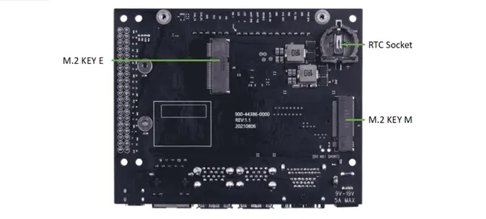
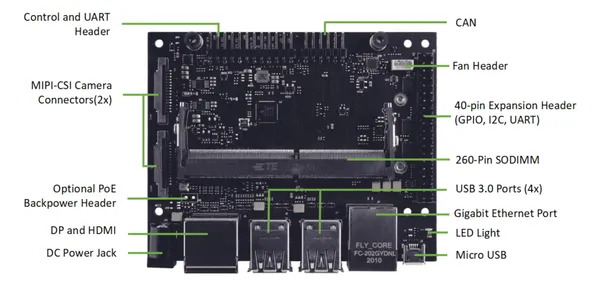

# reComputer J2011

**Seeed Studio** · Source collection

Revision: Unverified source identity  
Coverage: Source collection; review pending

[Browse all manufacturers](../../../../BROWSE.md) · [Desktop app](https://github.com/valleytechsolutions/black-wire-desktop)

## Hardware Overview (Back)

**source reference** · Unreviewed source · JPG

[Open original reference](../../../../library/media/3287a3fe333dd75f3c263c6a3993ebdb90d21a27b44e82616dbf17584d8eb25e.jpg)

**Credit and rights:** Source rights not yet established. Source/manufacturer: Seeed Studio.

[Source 1](https://files.seeedstudio.com/wiki/recomputer-Jetson-20-1-H1/Jetsonh02carriedboards.jpg) · [Source 2](https://wiki.seeedstudio.com/reComputer_Jetson_Series_Hardware_Layout/)

Original source index: Hardware Overview (Back). This file is searchable but has not been promoted to a reviewed physical board pinout.

SHA-256: `3287a3fe333dd75f3c263c6a3993ebdb90d21a27b44e82616dbf17584d8eb25e`

## Hardware Overview (Front)

**source reference** · Unreviewed source · JPG

[Open original reference](../../../../library/media/5b0844ef899ebd582173996010b637ce54d3344e7b64fdfdce401216bd09c301.jpg)

**Credit and rights:** Source rights not yet established. Source/manufacturer: Seeed Studio.

[Source 1](https://files.seeedstudio.com/wiki/recomputer-Jetson-20-1-H1/Jetsonh02carriedboard.jpg) · [Source 2](https://wiki.seeedstudio.com/reComputer_Jetson_Series_Hardware_Layout/)

Original source index: Hardware Overview (Front). This file is searchable but has not been promoted to a reviewed physical board pinout.

SHA-256: `5b0844ef899ebd582173996010b637ce54d3344e7b64fdfdce401216bd09c301`

## Pin Definition

**source reference** · Unreviewed source · PDF

[Open original reference](../../../../library/media/b8319b3bb9e31b6146dfd8f60d91364883df57cf07914d35fcac7d7896e8d1c4.pdf)

**Credit and rights:** Source rights not yet established. Source/manufacturer: Seeed Studio.

Original source index: Pin Definition. This file is searchable but has not been promoted to a reviewed physical board pinout.

SHA-256: `b8319b3bb9e31b6146dfd8f60d91364883df57cf07914d35fcac7d7896e8d1c4`

Pin assignments have not been independently electrically verified. Check board revision before wiring.
