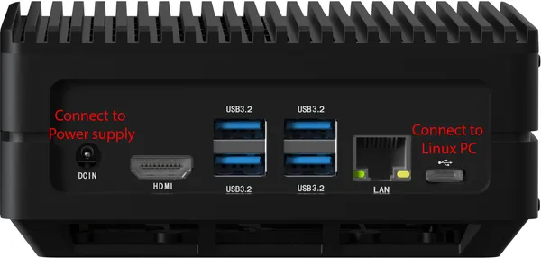
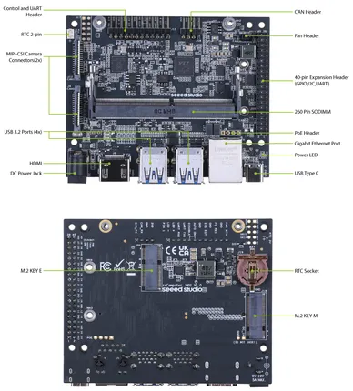
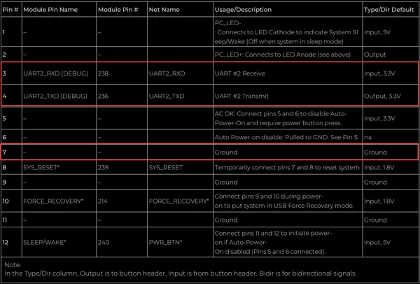

# reComputer J3010

**Seeed Studio** · Source collection

Revision: Unverified source identity  
Coverage: Source collection; review pending

[Browse all manufacturers](../../../../BROWSE.md) · [Desktop app](https://github.com/valleytechsolutions/black-wire-desktop)

## Hardware Overview (Back)

**source reference** · Unreviewed source · PNG

[Open original reference](../../../../library/media/9782387f120f0110cf316a79784bd92ed7f9bb718ac8acab9e29a66fa8430b12.png)

**Credit and rights:** Source rights not yet established. Source/manufacturer: Seeed Studio.

[Source 1](https://files.seeedstudio.com/wiki/reComputer-J4012/2.png) · [Source 2](https://wiki.seeedstudio.com/reComputer_J4012_Flash_Jetpack/)

Original source index: Hardware Overview (Back). This file is searchable but has not been promoted to a reviewed physical board pinout.

SHA-256: `9782387f120f0110cf316a79784bd92ed7f9bb718ac8acab9e29a66fa8430b12`

## Hardware Overview

**source reference** · Unreviewed source · PNG

[Open original reference](../../../../library/media/bcb245f50f39459ba45dc71bd17bf617c4dd9249b8176b455b61564ba131a119.png)

**Credit and rights:** Source rights not yet established. Source/manufacturer: Seeed Studio.

[Source 1](https://files.seeedstudio.com/wiki/reComputer-J4012/6.png) · [Source 2](https://wiki.seeedstudio.com/reComputer_J4012_Flash_Jetpack/)

Original source index: Hardware Overview. This file is searchable but has not been promoted to a reviewed physical board pinout.

SHA-256: `bcb245f50f39459ba45dc71bd17bf617c4dd9249b8176b455b61564ba131a119`

## Pin Definition Table

**source reference** · Unreviewed source · PNG

[Open original reference](../../../../library/media/018fac4aab7479a8ef6b1292db5efd68e349b2055062e8dad5ed651589507dbb.png)

**Credit and rights:** Source rights not yet established. Source/manufacturer: Seeed Studio.

[Source 1](https://files.seeedstudio.com/wiki/reComputer-Jetson/FAQ/pin.png) · [Source 2](https://wiki.seeedstudio.com/get_the_system_log_of_recomputer_j30_and_j40/)

Original source index: Pin Definition Table. This file is searchable but has not been promoted to a reviewed physical board pinout.

SHA-256: `018fac4aab7479a8ef6b1292db5efd68e349b2055062e8dad5ed651589507dbb`

Pin assignments have not been independently electrically verified. Check board revision before wiring.
