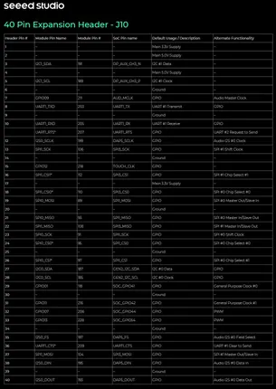

# reComputer J4012

**Seeed Studio** · Source collection

Revision: Unverified source identity  
Coverage: Source collection; review pending

[Browse all manufacturers](../../../../BROWSE.md) · [Desktop app](https://github.com/valleytechsolutions/black-wire-desktop)

## Pin Functions

**source reference** · Unreviewed source · PNG

[Open original reference](../../../../library/media/57f8ccca04ebb18d692c0519cc7fbad0cb929f35f207c67d852c88ee8fab1483.png)

**Credit and rights:** Source rights not yet established. Source/manufacturer: Seeed Studio.

Original source index: Pin Functions. This file is searchable but has not been promoted to a reviewed physical board pinout.

SHA-256: `57f8ccca04ebb18d692c0519cc7fbad0cb929f35f207c67d852c88ee8fab1483`

Pin assignments have not been independently electrically verified. Check board revision before wiring.
