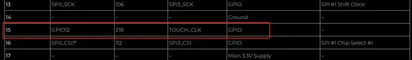
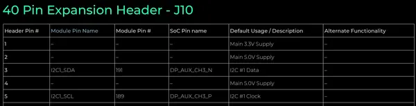

# reComputer Jetson Series

**Seeed Studio** · Source collection

Revision: Unverified source identity  
Coverage: Source collection; review pending

[Browse all manufacturers](../../../../BROWSE.md) · [Desktop app](https://github.com/valleytechsolutions/black-wire-desktop)

## Pin Definition Table

**source reference** · Unreviewed source · JPG

[Open original reference](../../../../library/media/6c759e74b4bb78c3d5ef6c410e9552f32dc5536bf9d1911b46fd588d5251e4e8.jpg)

**Credit and rights:** Source rights not yet established. Source/manufacturer: Seeed Studio.

Original source index: Pin Definition Table. This file is searchable but has not been promoted to a reviewed physical board pinout.

SHA-256: `6c759e74b4bb78c3d5ef6c410e9552f32dc5536bf9d1911b46fd588d5251e4e8`

## Pin Definition Table

**source reference** · Unreviewed source · PNG

[Open original reference](../../../../library/media/7bdfc0c21a4800973b0b2bd6dbdf4f1590e60cafad256207fcf6337b7a317893.png)

**Credit and rights:** Source rights not yet established. Source/manufacturer: Seeed Studio.

Original source index: Pin Definition Table. This file is searchable but has not been promoted to a reviewed physical board pinout.

SHA-256: `7bdfc0c21a4800973b0b2bd6dbdf4f1590e60cafad256207fcf6337b7a317893`

## Pinout Sheet

**source reference** · Unreviewed source · PDF

[Open original reference](../../../../library/media/6e1f42f4a9bd9d826773ba2f0283bec45e808f09e0911a475cee84556b5f3a2b.pdf)

**Credit and rights:** Source rights not yet established. Source/manufacturer: Seeed Studio.

[Source 1](https://files.seeedstudio.com/products/114110049/A206%20carrier%20board%20pin%20description.pdf) · [Source 2](https://wiki.seeedstudio.com/reComputer_Jetson_GPIO/)

Original source index: Pinout Sheet. This file is searchable but has not been promoted to a reviewed physical board pinout.

SHA-256: `6e1f42f4a9bd9d826773ba2f0283bec45e808f09e0911a475cee84556b5f3a2b`

Pin assignments have not been independently electrically verified. Check board revision before wiring.
