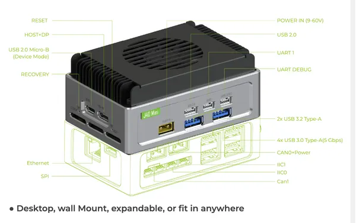
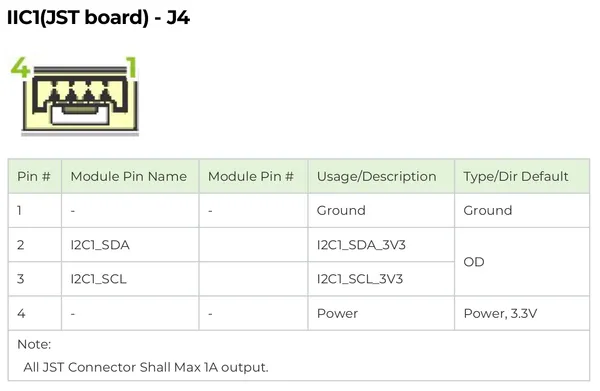
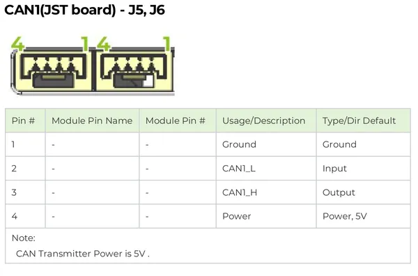
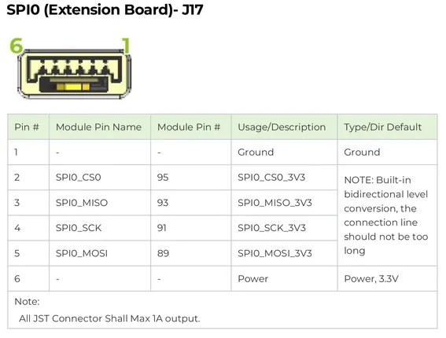
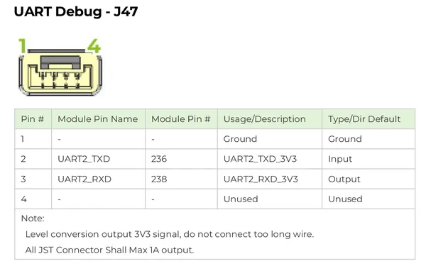
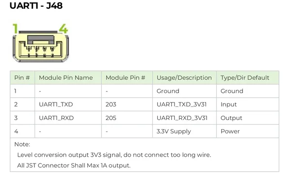
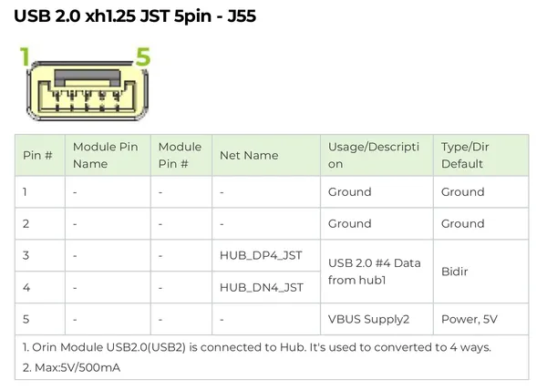
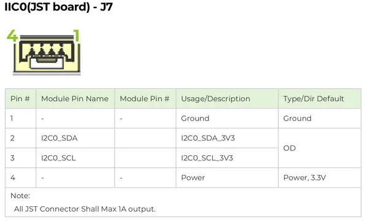
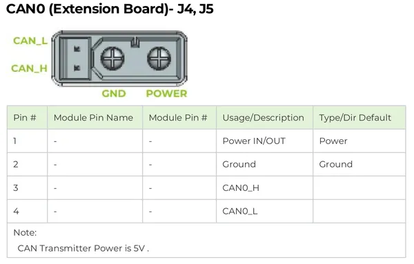

# reComputer Mini J3010

**Seeed Studio** · Source collection

Revision: Unverified source identity  
Coverage: Source collection; review pending

[Browse all manufacturers](../../../../BROWSE.md) · [Desktop app](https://github.com/valleytechsolutions/black-wire-desktop)

## Hardware Overview

**source reference** · Unreviewed source · PNG

[Open original reference](../../../../library/media/01a8c24be363564c2a170f9aad761322d8b3c41f4adf41ba64967a13095081fd.png)

**Credit and rights:** Source rights not yet established. Source/manufacturer: Seeed Studio.

Original source index: Hardware Overview. This file is searchable but has not been promoted to a reviewed physical board pinout.

SHA-256: `01a8c24be363564c2a170f9aad761322d8b3c41f4adf41ba64967a13095081fd`

## Pin Definition Table 2

**source reference** · Unreviewed source · JPG

[Open original reference](../../../../library/media/ee69177677a24cfba8e040dd239b036581e5ddfc9fbd4d033f958cf8790ab5d4.jpg)

**Credit and rights:** Source rights not yet established. Source/manufacturer: Seeed Studio.

Original source index: Pin Definition Table 2. This file is searchable but has not been promoted to a reviewed physical board pinout.

SHA-256: `ee69177677a24cfba8e040dd239b036581e5ddfc9fbd4d033f958cf8790ab5d4`

## Pin Definition Table 2

**source reference** · Unreviewed source · PNG

[Open original reference](../../../../library/media/9d6eabd70113f8975bf83c1eb2e02ad07a71079ea4f7c499af0bf66002fc7048.png)

**Credit and rights:** Source rights not yet established. Source/manufacturer: Seeed Studio.

Original source index: Pin Definition Table 2. This file is searchable but has not been promoted to a reviewed physical board pinout.

SHA-256: `9d6eabd70113f8975bf83c1eb2e02ad07a71079ea4f7c499af0bf66002fc7048`

## Pin Definition Table 3

**source reference** · Unreviewed source · JPG

[Open original reference](../../../../library/media/23639aaa0cbd07616a245772ecdbb101a0426e0075e9e21df20f7c097ab899e0.jpg)

**Credit and rights:** Source rights not yet established. Source/manufacturer: Seeed Studio.

Original source index: Pin Definition Table 3. This file is searchable but has not been promoted to a reviewed physical board pinout.

SHA-256: `23639aaa0cbd07616a245772ecdbb101a0426e0075e9e21df20f7c097ab899e0`

## Pin Definition Table 3

**source reference** · Unreviewed source · PNG

[Open original reference](../../../../library/media/bb01902801c4ab212db788f6b0dacf2364eb98e748d945e263348b7b7f4c04e2.png)

**Credit and rights:** Source rights not yet established. Source/manufacturer: Seeed Studio.

Original source index: Pin Definition Table 3. This file is searchable but has not been promoted to a reviewed physical board pinout.

SHA-256: `bb01902801c4ab212db788f6b0dacf2364eb98e748d945e263348b7b7f4c04e2`

## Pin Definition Table 4

**source reference** · Unreviewed source · PNG

[Open original reference](../../../../library/media/61fa23ee68e67dc3412720c3301b44b27f92282a75718ba6460df055761b8a8d.png)

**Credit and rights:** Source rights not yet established. Source/manufacturer: Seeed Studio.

Original source index: Pin Definition Table 4. This file is searchable but has not been promoted to a reviewed physical board pinout.

SHA-256: `61fa23ee68e67dc3412720c3301b44b27f92282a75718ba6460df055761b8a8d`

## Pin Definition Table 5

**source reference** · Unreviewed source · PNG

[Open original reference](../../../../library/media/89e7a591ec24fba523dd625e761f7b8770d535d816c861d7e281673ae4bfa0a2.png)

**Credit and rights:** Source rights not yet established. Source/manufacturer: Seeed Studio.

Original source index: Pin Definition Table 5. This file is searchable but has not been promoted to a reviewed physical board pinout.

SHA-256: `89e7a591ec24fba523dd625e761f7b8770d535d816c861d7e281673ae4bfa0a2`

## Pin Definition Table

**source reference** · Unreviewed source · JPG

[Open original reference](../../../../library/media/5f1c62004b00bd092626a8da2bce198098300b36457ed74da1222aeaf34d142c.jpg)

**Credit and rights:** Source rights not yet established. Source/manufacturer: Seeed Studio.

Original source index: Pin Definition Table. This file is searchable but has not been promoted to a reviewed physical board pinout.

SHA-256: `5f1c62004b00bd092626a8da2bce198098300b36457ed74da1222aeaf34d142c`

## Pin Definition Table

**source reference** · Unreviewed source · PNG

[Open original reference](../../../../library/media/372eb62bc0d498e3f76ae5a68da4394324542cbe852d2410cac4f53ebdbd0b23.png)

**Credit and rights:** Source rights not yet established. Source/manufacturer: Seeed Studio.

Original source index: Pin Definition Table. This file is searchable but has not been promoted to a reviewed physical board pinout.

SHA-256: `372eb62bc0d498e3f76ae5a68da4394324542cbe852d2410cac4f53ebdbd0b23`

Pin assignments have not been independently electrically verified. Check board revision before wiring.
