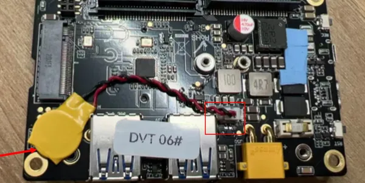
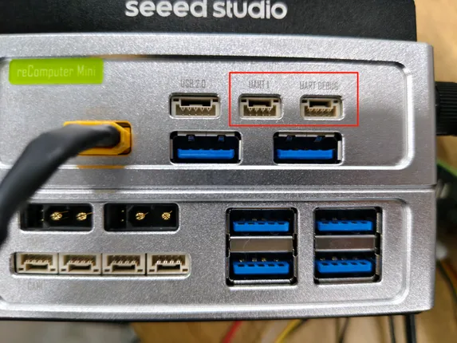

# reComputer Mini J3011

**Seeed Studio** · Source collection

Revision: Unverified source identity  
Coverage: Source collection; review pending

[Browse all manufacturers](../../../../BROWSE.md) · [Desktop app](https://github.com/valleytechsolutions/black-wire-desktop)

## Hardware Overview (Inside)

**source reference** · Unreviewed source · PNG

[Open original reference](../../../../library/media/3cb70eb9572ca4cf8e147c439db22398abf08af907a8453f9eb27ccd4235bf80.png)

**Credit and rights:** Source rights not yet established. Source/manufacturer: Seeed Studio.

[Source 1](https://files.seeedstudio.com/wiki/reComputer-Jetson/mini/rtc.png) · [Source 2](https://wiki.seeedstudio.com/recomputer_jetson_mini_hardware_interfaces_usage/)

Original source index: Hardware Overview (Inside). This file is searchable but has not been promoted to a reviewed physical board pinout.

SHA-256: `3cb70eb9572ca4cf8e147c439db22398abf08af907a8453f9eb27ccd4235bf80`

## Hardware Overview (Ports)

**source reference** · Unreviewed source · PNG

[Open original reference](../../../../library/media/b7514d13e2f09af80bb6b4c7713f29392d2816a25bf2194339e011c09dee5f5b.png)

**Credit and rights:** Source rights not yet established. Source/manufacturer: Seeed Studio.

[Source 1](https://files.seeedstudio.com/wiki/recomputer_mini/uart_photo.png) · [Source 2](https://wiki.seeedstudio.com/recomputer_jetson_mini_hardware_interfaces_usage/)

Original source index: Hardware Overview (Ports). This file is searchable but has not been promoted to a reviewed physical board pinout.

SHA-256: `b7514d13e2f09af80bb6b4c7713f29392d2816a25bf2194339e011c09dee5f5b`

Pin assignments have not been independently electrically verified. Check board revision before wiring.
