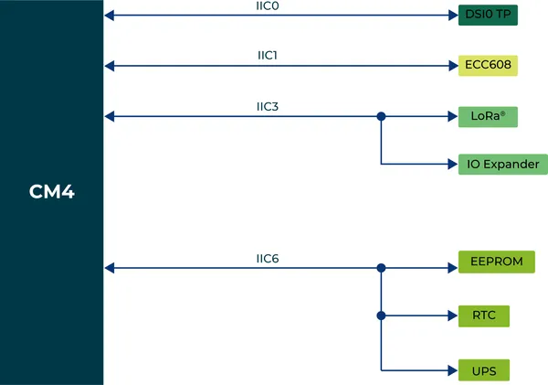
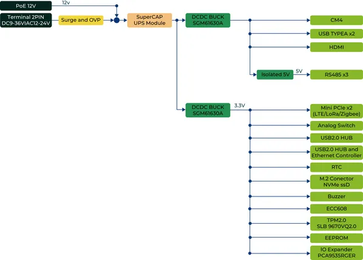
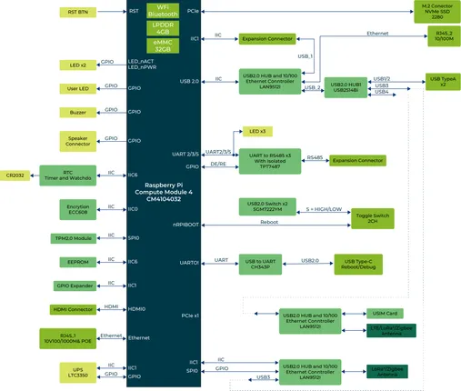
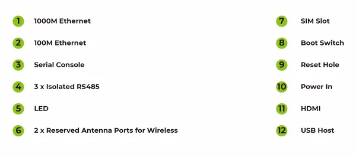
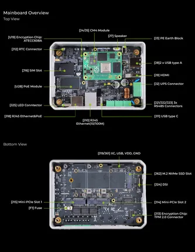
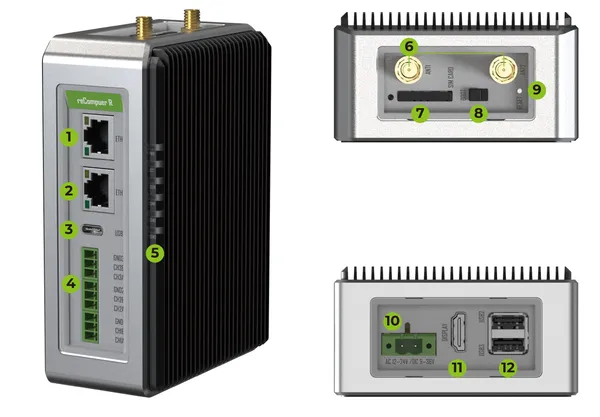

# reComputer R1000

**Seeed Studio** · Source collection

Revision: Unverified source identity  
Coverage: Source collection; review pending

[Browse all manufacturers](../../../../BROWSE.md) · [Desktop app](https://github.com/valleytechsolutions/black-wire-desktop)

## Block Diagram (I2C)

**source reference** · Unreviewed source · PNG

[Open original reference](../../../../library/media/2f8614c1c257ba5601a7f977c887b83c881d5e77a8fd54803f63d6678947ea73.png)

**Credit and rights:** Source rights not yet established. Source/manufacturer: Seeed Studio.

Original source index: Block Diagram (I2C). This file is searchable but has not been promoted to a reviewed physical board pinout.

SHA-256: `2f8614c1c257ba5601a7f977c887b83c881d5e77a8fd54803f63d6678947ea73`

## Block Diagram (Power)

**source reference** · Unreviewed source · PNG

[Open original reference](../../../../library/media/695a2db99d53d0df8f6060445cdcca86a69c0a9a582af93e0902fb988aa929fd.png)

**Credit and rights:** Source rights not yet established. Source/manufacturer: Seeed Studio.

Original source index: Block Diagram (Power). This file is searchable but has not been promoted to a reviewed physical board pinout.

SHA-256: `695a2db99d53d0df8f6060445cdcca86a69c0a9a582af93e0902fb988aa929fd`

## Block Diagram

**source reference** · Unreviewed source · PNG

[Open original reference](../../../../library/media/d4d11090f47e92072462b5d374f09382468812df6fa2b37a459e0560c0d3743f.png)

**Credit and rights:** Source rights not yet established. Source/manufacturer: Seeed Studio.

Original source index: Block Diagram. This file is searchable but has not been promoted to a reviewed physical board pinout.

SHA-256: `d4d11090f47e92072462b5d374f09382468812df6fa2b37a459e0560c0d3743f`

## Hardware Overview 2

**source reference** · Unreviewed source · PNG

[Open original reference](../../../../library/media/02ce4e6c9b9b3594da3bc195590e58979489ee3d2f0687342fe4b57ff6c6c336.png)

**Credit and rights:** Source rights not yet established. Source/manufacturer: Seeed Studio.

Original source index: Hardware Overview 2. This file is searchable but has not been promoted to a reviewed physical board pinout.

SHA-256: `02ce4e6c9b9b3594da3bc195590e58979489ee3d2f0687342fe4b57ff6c6c336`

## Hardware Overview 3

**source reference** · Unreviewed source · PNG

[Open original reference](../../../../library/media/5ce62c99cf0dcf0e1a857d50cc4e5fc1f7e6c676a317a39f5cba2cbc238ad0f9.png)

**Credit and rights:** Source rights not yet established. Source/manufacturer: Seeed Studio.

Original source index: Hardware Overview 3. This file is searchable but has not been promoted to a reviewed physical board pinout.

SHA-256: `5ce62c99cf0dcf0e1a857d50cc4e5fc1f7e6c676a317a39f5cba2cbc238ad0f9`

## Hardware Overview

**source reference** · Unreviewed source · PNG

[Open original reference](../../../../library/media/98849cae51957d80c7fd24859376669132f557187f0a129d3f68f5db4ce72f9a.png)

**Credit and rights:** Source rights not yet established. Source/manufacturer: Seeed Studio.

Original source index: Hardware Overview. This file is searchable but has not been promoted to a reviewed physical board pinout.

SHA-256: `98849cae51957d80c7fd24859376669132f557187f0a129d3f68f5db4ce72f9a`

## Pinout Sheet

**source reference** · Unreviewed source · XLSX

[Open original reference](../../../../library/media/5f347f8e4821fef90258d357664a6d5cb8bb348b6df89b06bb7b891eb7b9d93e.xlsx)

**Credit and rights:** Source rights not yet established. Source/manufacturer: Seeed Studio.

Original source index: Pinout Sheet. This file is searchable but has not been promoted to a reviewed physical board pinout.

SHA-256: `5f347f8e4821fef90258d357664a6d5cb8bb348b6df89b06bb7b891eb7b9d93e`

Pin assignments have not been independently electrically verified. Check board revision before wiring.
