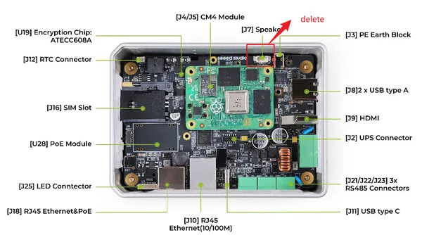

# reComputer R1000 V1.1

**Seeed Studio** · Source collection

Revision: Unverified source identity  
Coverage: Source collection; review pending

[Browse all manufacturers](../../../../BROWSE.md) · [Desktop app](https://github.com/valleytechsolutions/black-wire-desktop)

## Hardware Overview (Inside)

**source reference** · Unreviewed source · PNG

[Open original reference](../../../../library/media/4a5c420f82bbbe95bcd00544c2052f53f817842bcb437f77deb8182a3cf6707d.png)

**Credit and rights:** Source rights not yet established. Source/manufacturer: Seeed Studio.

[Source 1](https://files.seeedstudio.com/wiki/reComputer-R1000/PCN/delete.png) · [Source 2](https://wiki.seeedstudio.com/recomputer_r1000_v1_1_description/)

Original source index: Hardware Overview (Inside). This file is searchable but has not been promoted to a reviewed physical board pinout.

SHA-256: `4a5c420f82bbbe95bcd00544c2052f53f817842bcb437f77deb8182a3cf6707d`

Pin assignments have not been independently electrically verified. Check board revision before wiring.
