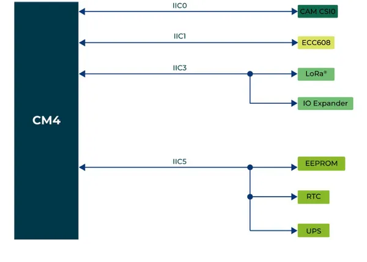
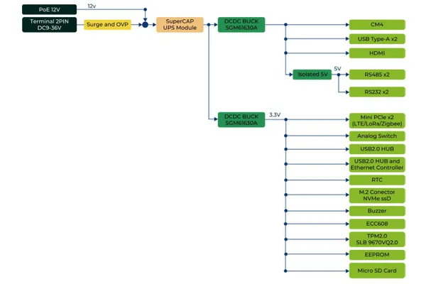
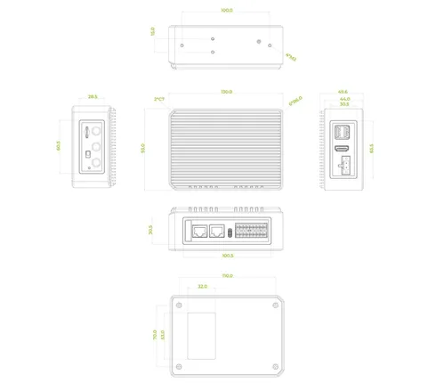
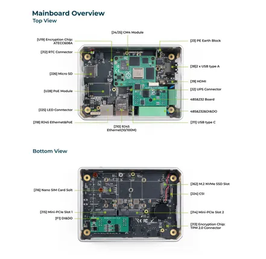
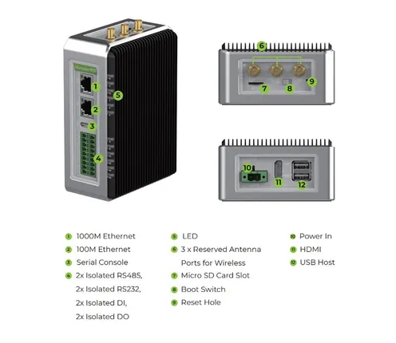

# reComputer R1100

**Seeed Studio** · Source collection

Revision: Unverified source identity  
Coverage: Source collection; review pending

[Browse all manufacturers](../../../../BROWSE.md) · [Desktop app](https://github.com/valleytechsolutions/black-wire-desktop)

## Block Diagram (I2C)

**source reference** · Unreviewed source · PNG

[Open original reference](../../../../library/media/87f5d85411ef93cf14abb479b7264d989ec6dfb07f8111c8ba3f8ab5a953e343.png)

**Credit and rights:** Source rights not yet established. Source/manufacturer: Seeed Studio.

[Source 1](https://files.seeedstudio.com/wiki/R1100/IIC.PNG) · [Source 2](https://wiki.seeedstudio.com/recomputer_r1100_intro/)

Original source index: Block Diagram (I2C). This file is searchable but has not been promoted to a reviewed physical board pinout.

SHA-256: `87f5d85411ef93cf14abb479b7264d989ec6dfb07f8111c8ba3f8ab5a953e343`

## Block Diagram (Power)

**source reference** · Unreviewed source · PNG

[Open original reference](../../../../library/media/2f989b7be185f765b312e70988a878d1c93f92e2c311a79c1f4f2af4a2d47dd5.png)

**Credit and rights:** Source rights not yet established. Source/manufacturer: Seeed Studio.

[Source 1](https://files.seeedstudio.com/wiki/R1100/power.PNG) · [Source 2](https://wiki.seeedstudio.com/recomputer_r1100_intro/)

Original source index: Block Diagram (Power). This file is searchable but has not been promoted to a reviewed physical board pinout.

SHA-256: `2f989b7be185f765b312e70988a878d1c93f92e2c311a79c1f4f2af4a2d47dd5`

## Dimensions

**source reference** · Unreviewed source · PNG

[Open original reference](../../../../library/media/970562a8148de730ea19f4eeabf046736603b856b00174264bb9bb6a2642b1f6.png)

**Credit and rights:** Source rights not yet established. Source/manufacturer: Seeed Studio.

[Source 1](https://files.seeedstudio.com/wiki/R1100/dimensions.PNG) · [Source 2](https://wiki.seeedstudio.com/recomputer_r1100_intro/)

Original source index: Dimensions. This file is searchable but has not been promoted to a reviewed physical board pinout.

SHA-256: `970562a8148de730ea19f4eeabf046736603b856b00174264bb9bb6a2642b1f6`

## Hardware Overview 2

**source reference** · Unreviewed source · PNG

[Open original reference](../../../../library/media/adee0f203a6618e0a17e84433636b0de3710f92fbef89e1afcae1d67d2206e67.png)

**Credit and rights:** Source rights not yet established. Source/manufacturer: Seeed Studio.

[Source 1](https://files.seeedstudio.com/wiki/R1100/mainboard.PNG) · [Source 2](https://wiki.seeedstudio.com/recomputer_r1100_intro/)

Original source index: Hardware Overview 2. This file is searchable but has not been promoted to a reviewed physical board pinout.

SHA-256: `adee0f203a6618e0a17e84433636b0de3710f92fbef89e1afcae1d67d2206e67`

## Hardware Overview

**source reference** · Unreviewed source · PNG

[Open original reference](../../../../library/media/65353c66982011019b7c5a82b7b4a147a611ced8f7cb695bb640d9a1f9dad01a.png)

**Credit and rights:** Source rights not yet established. Source/manufacturer: Seeed Studio.

[Source 1](https://files.seeedstudio.com/wiki/R1100/interface.PNG) · [Source 2](https://wiki.seeedstudio.com/recomputer_r1100_intro/)

Original source index: Hardware Overview. This file is searchable but has not been promoted to a reviewed physical board pinout.

SHA-256: `65353c66982011019b7c5a82b7b4a147a611ced8f7cb695bb640d9a1f9dad01a`

Pin assignments have not been independently electrically verified. Check board revision before wiring.
