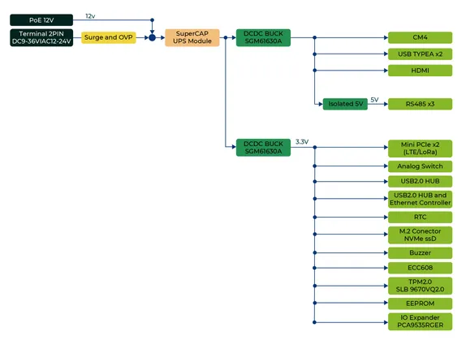
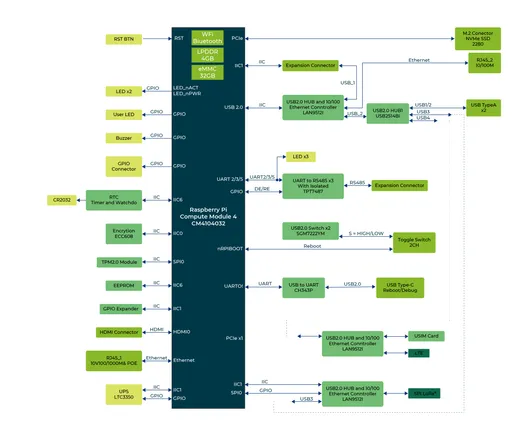
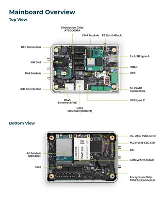
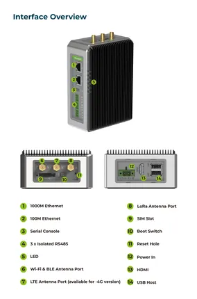

# reComputer R1225

**Seeed Studio** · Source collection

Revision: Unverified source identity  
Coverage: Source collection; review pending

[Browse all manufacturers](../../../../BROWSE.md) · [Desktop app](https://github.com/valleytechsolutions/black-wire-desktop)

## Block Diagram (Power)

**source reference** · Unreviewed source · JPG

[Open original reference](../../../../library/media/43f72edc46fe9675053a725578a774e2c801f55120426d08608ac92ae58f8520.jpg)

**Credit and rights:** Source rights not yet established. Source/manufacturer: Seeed Studio.

[Source 1](https://files.seeedstudio.com/wiki/reComputer_1225_LoRaWAN_Gateway/img/Product_Details_Image/Power_Diagram04.jpg) · [Source 2](https://wiki.seeedstudio.com/r1225_introduction/)

Original source index: Block Diagram (Power). This file is searchable but has not been promoted to a reviewed physical board pinout.

SHA-256: `43f72edc46fe9675053a725578a774e2c801f55120426d08608ac92ae58f8520`

## Block Diagram

**source reference** · Unreviewed source · JPG

[Open original reference](../../../../library/media/049934fcbb96c6271be3655b864f790b7548eded5836cfa34420a0f5de06431e.jpg)

**Credit and rights:** Source rights not yet established. Source/manufacturer: Seeed Studio.

[Source 1](https://files.seeedstudio.com/wiki/reComputer_1225_LoRaWAN_Gateway/img/Product_Details_Image/Block_Diagram05.jpg) · [Source 2](https://wiki.seeedstudio.com/r1225_introduction/)

Original source index: Block Diagram. This file is searchable but has not been promoted to a reviewed physical board pinout.

SHA-256: `049934fcbb96c6271be3655b864f790b7548eded5836cfa34420a0f5de06431e`

## Hardware Overview (Inside)

**source reference** · Unreviewed source · JPG

[Open original reference](../../../../library/media/77bac9205a1918f7a18ec24466203749acd3fe071afd6029a1fc9909e777231c.jpg)

**Credit and rights:** Source rights not yet established. Source/manufacturer: Seeed Studio.

[Source 1](https://files.seeedstudio.com/wiki/reComputer_1225_LoRaWAN_Gateway/img/Product_Details_Image/Mainboard_Overview02.jpg) · [Source 2](https://wiki.seeedstudio.com/r1225_introduction/)

Original source index: Hardware Overview (Inside). This file is searchable but has not been promoted to a reviewed physical board pinout.

SHA-256: `77bac9205a1918f7a18ec24466203749acd3fe071afd6029a1fc9909e777231c`

## Hardware Overview (Ports)

**source reference** · Unreviewed source · JPG

[Open original reference](../../../../library/media/f504fd6d453b076959b4c1f0a5a7a8117cfa188771dd9671450096594c7b8930.jpg)

**Credit and rights:** Source rights not yet established. Source/manufacturer: Seeed Studio.

[Source 1](https://files.seeedstudio.com/wiki/reComputer_1225_LoRaWAN_Gateway/img/Product_Details_Image/Hardware_Overview03.jpg) · [Source 2](https://wiki.seeedstudio.com/r1225_introduction/)

Original source index: Hardware Overview (Ports). This file is searchable but has not been promoted to a reviewed physical board pinout.

SHA-256: `f504fd6d453b076959b4c1f0a5a7a8117cfa188771dd9671450096594c7b8930`

Pin assignments have not been independently electrically verified. Check board revision before wiring.
