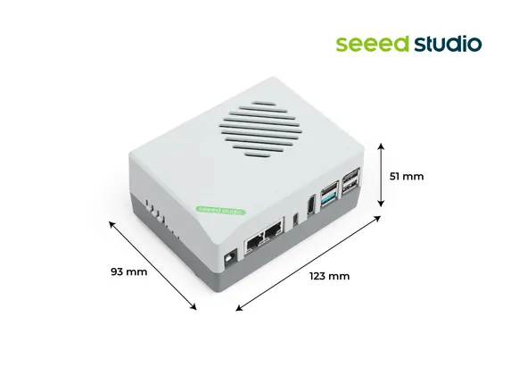
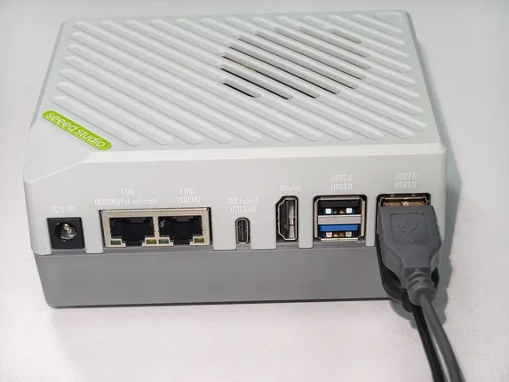
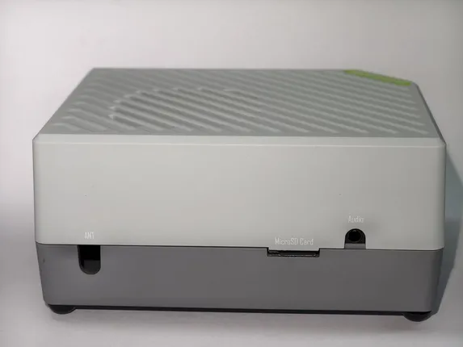

# reComputer RK3576-20

**Seeed Studio** · Source collection

Revision: Unverified source identity  
Coverage: Source collection; review pending

[Browse all manufacturers](../../../../BROWSE.md) · [Desktop app](https://github.com/valleytechsolutions/black-wire-desktop)

## Dimensions

**source reference** · Unreviewed source · JPG

[Open original reference](../../../../library/media/8b65677b1cd638d7f7d35348266b3b8754eb8e36f0919f7ee202f1b27d4a9300.jpg)

**Credit and rights:** Source rights not yet established. Source/manufacturer: Seeed Studio.

[Source 1](https://media-cdn.seeedstudio.com/media/catalog/product/6/-/6-recomputer-rk3576_1.jpg) · [Source 2](https://www.seeedstudio.com/reComputer-RK3576-20-p-6816.html)

Original source index: Dimensions. This file is searchable but has not been promoted to a reviewed physical board pinout.

SHA-256: `8b65677b1cd638d7f7d35348266b3b8754eb8e36f0919f7ee202f1b27d4a9300`

## Hardware Overview (Front)

**source reference** · Unreviewed source · JPG

[Open original reference](../../../../library/media/bac1dca95ba34ab6eb186d2be2d5cd89a6ec9add7475673067f06f3d6a95463f.jpg)

**Credit and rights:** Source rights not yet established. Source/manufacturer: Seeed Studio.

[Source 1](https://files.seeedstudio.com/wiki/reComputer_RK/ai_lab/tutorials/2.jpg) · [Source 2](https://sensecraft.seeed.cc/ai-lab/tutorials/rk/getting-start/hardware-connection (linked from the product page's "Wiki & Learn" tab))

Original source index: Hardware Overview (Front). This file is searchable but has not been promoted to a reviewed physical board pinout.

SHA-256: `bac1dca95ba34ab6eb186d2be2d5cd89a6ec9add7475673067f06f3d6a95463f`

## Hardware Overview (Side)

**source reference** · Unreviewed source · JPG

[Open original reference](../../../../library/media/4bdc82a3adc695b226976e45a2a0af0489a15acf1728098c635cf986afd8772b.jpg)

**Credit and rights:** Source rights not yet established. Source/manufacturer: Seeed Studio.

[Source 1](https://files.seeedstudio.com/wiki/reComputer_RK/ai_lab/tutorials/1.jpg) · [Source 2](https://sensecraft.seeed.cc/ai-lab/tutorials/rk/getting-start/hardware-connection (linked from the product page's "Wiki & Learn" tab))

Original source index: Hardware Overview (Side). This file is searchable but has not been promoted to a reviewed physical board pinout.

SHA-256: `4bdc82a3adc695b226976e45a2a0af0489a15acf1728098c635cf986afd8772b`

## Interfaces

**source reference** · Unreviewed source · JPG

[Open original reference](../../../../library/media/68a5fda5054dcb7679a823257b93cbf3fdbca4a372cbd941ff0aaa7004e163c9.jpg)

**Credit and rights:** Source rights not yet established. Source/manufacturer: Seeed Studio.

[Source 1](https://media-cdn.seeedstudio.com/media/catalog/product/1/0/10-recomputer-rk3576.jpg) · [Source 2](https://www.seeedstudio.com/reComputer-RK3576-20-p-6816.html)

Original source index: Interfaces. This file is searchable but has not been promoted to a reviewed physical board pinout.

SHA-256: `68a5fda5054dcb7679a823257b93cbf3fdbca4a372cbd941ff0aaa7004e163c9`

Pin assignments have not been independently electrically verified. Check board revision before wiring.
