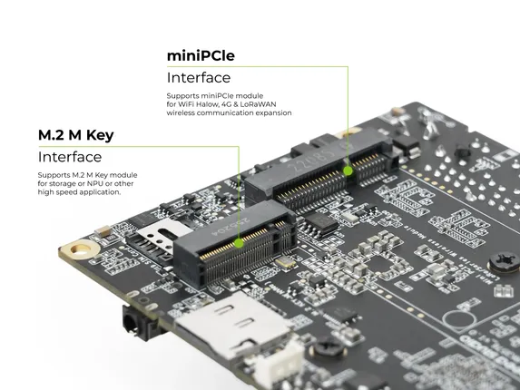

# reComputer RK3576-30

**Seeed Studio** · Source collection

Revision: Unverified source identity  
Coverage: Source collection; review pending

[Browse all manufacturers](../../../../BROWSE.md) · [Desktop app](https://github.com/valleytechsolutions/black-wire-desktop)

## Dimensions

**source reference** · Unreviewed source · JPG

[Open original reference](../../../../library/media/15ee9687a73b5b07a4431ab877853d65c62611240ee9c24eb1f2b09541435212.jpg)

**Credit and rights:** Source rights not yet established. Source/manufacturer: Seeed Studio.

[Source 1](https://media-cdn.seeedstudio.com/media/catalog/product/6/-/6-recomputer-rk3576.jpg) · [Source 2](https://www.seeedstudio.com/reComputer-RK3576-30-p-6815.html)

Original source index: Dimensions. This file is searchable but has not been promoted to a reviewed physical board pinout.

SHA-256: `15ee9687a73b5b07a4431ab877853d65c62611240ee9c24eb1f2b09541435212`

## Interfaces

**source reference** · Unreviewed source · JPG

[Open original reference](../../../../library/media/1f26705cd4e232d488332c805bb60561ef8da728dd02fb9d0caa08882dfcc841.jpg)

**Credit and rights:** Source rights not yet established. Source/manufacturer: Seeed Studio.

[Source 1](https://media-cdn.seeedstudio.com/media/catalog/product/1/0/10-recomputer-rk3576_1.jpg) · [Source 2](https://www.seeedstudio.com/reComputer-RK3576-30-p-6815.html)

Original source index: Interfaces. This file is searchable but has not been promoted to a reviewed physical board pinout.

SHA-256: `1f26705cd4e232d488332c805bb60561ef8da728dd02fb9d0caa08882dfcc841`

Pin assignments have not been independently electrically verified. Check board revision before wiring.
