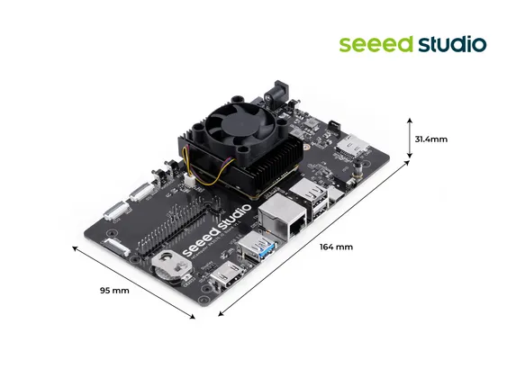
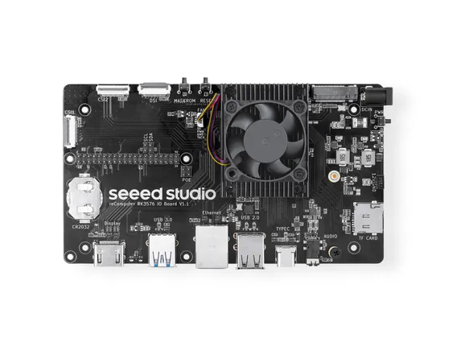

# reComputer RK3576 Module Dev Kit

**Seeed Studio** · Source collection

Revision: Unverified source identity

Coverage: Source collection; review pending

[Browse all manufacturers](../../../../BROWSE.md) · [Devices & IoT](../../../../DEVICES.md) · [Open in the browser guide](https://valleytech-black-wire-guide.pages.dev/?board=source-board-769f4e73d34427714a)

## Datasheets and original documentation

Board datasheet: **not yet recorded**. Visual reference: **available**.

[Manufacturer source (recorded link)](https://www.seeedstudio.com/reComputer-RK3576-Module-Dev-Kit-p-6952.html)

A chip datasheet, schematic and board datasheet have different scopes. Match the exact hardware revision.

[Documentation coverage and remaining gaps](../../../../DOCUMENTATION.md)

## Dimensions

**source reference** · Unreviewed source · JPG

[Open original reference](../../../../library/media/c53303991d89f30f5ae0bce4345a71f0c07f3934bd4ce0b8a752d2f6bdd9f172.jpg)

**Credit and rights:** Source rights not yet established. Source/manufacturer: Seeed Studio.

[Source 1](https://media-cdn.seeedstudio.com/media/catalog/product/1/0/100008205-gallery_img_6.jpg) · [Source 2](https://www.seeedstudio.com/reComputer-RK3576-Module-Dev-Kit-p-6952.html)

Original source index: Dimensions. This file is searchable but has not been promoted to a reviewed physical board pinout.

Image revision: Not identified

SHA-256: `c53303991d89f30f5ae0bce4345a71f0c07f3934bd4ce0b8a752d2f6bdd9f172`

## Hardware Overview (Top)

**source reference** · Unreviewed source · JPG

[Open original reference](../../../../library/media/bec60964d393421fcff664c3489a1d460dd1402d160ec0845971754174dac5b5.jpg)

**Credit and rights:** Source rights not yet established. Source/manufacturer: Seeed Studio.

[Source 1](https://media-cdn.seeedstudio.com/media/catalog/product/1/0/100008205-gallery_img_3.jpg) · [Source 2](https://www.seeedstudio.com/reComputer-RK3576-Module-Dev-Kit-p-6952.html)

Original source index: Hardware Overview (Top). This file is searchable but has not been promoted to a reviewed physical board pinout.

Image revision: Not identified

SHA-256: `bec60964d393421fcff664c3489a1d460dd1402d160ec0845971754174dac5b5`

Pin assignments have not been independently electrically verified. Check board revision before wiring.
