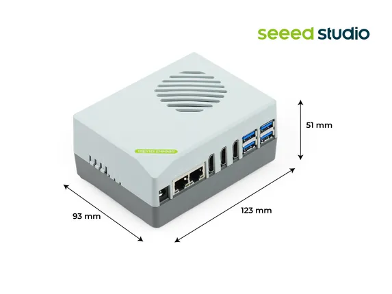
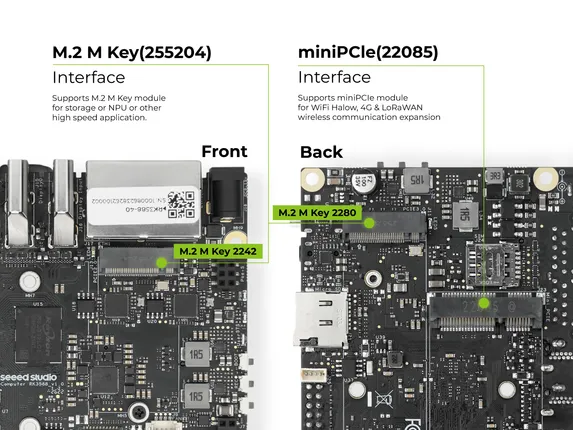

# reComputer RK3588-30

**Seeed Studio** · Source collection

Revision: Unverified source identity  
Coverage: Source collection; review pending

[Browse all manufacturers](../../../../BROWSE.md) · [Desktop app](https://github.com/valleytechsolutions/black-wire-desktop)

## Dimensions

**source reference** · Unreviewed source · JPG

[Open original reference](../../../../library/media/876077cabe4744fb4eb28861f9a080f3af1e8da99da420067a738c0b4628409a.jpg)

**Credit and rights:** Source rights not yet established. Source/manufacturer: Seeed Studio.

[Source 1](https://media-cdn.seeedstudio.com/media/catalog/product/7/-/7-recomputer-rk3588.jpg) · [Source 2](https://www.seeedstudio.com/reComputer-RK3588-30-p-6817.html)

Original source index: Dimensions. This file is searchable but has not been promoted to a reviewed physical board pinout.

SHA-256: `876077cabe4744fb4eb28861f9a080f3af1e8da99da420067a738c0b4628409a`

## Interfaces

**source reference** · Unreviewed source · JPG

[Open original reference](../../../../library/media/d2f2b8717de4e770ca773236e5372b91e319455377aa314d5394dc65b9b708d4.jpg)

**Credit and rights:** Source rights not yet established. Source/manufacturer: Seeed Studio.

[Source 1](https://media-cdn.seeedstudio.com/media/catalog/product/3/5/3588_7.22.jpg) · [Source 2](https://www.seeedstudio.com/reComputer-RK3588-30-p-6817.html)

Original source index: Interfaces. This file is searchable but has not been promoted to a reviewed physical board pinout.

SHA-256: `d2f2b8717de4e770ca773236e5372b91e319455377aa314d5394dc65b9b708d4`

Pin assignments have not been independently electrically verified. Check board revision before wiring.
