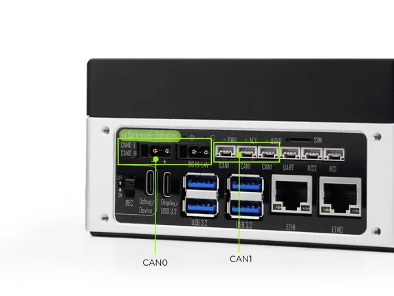
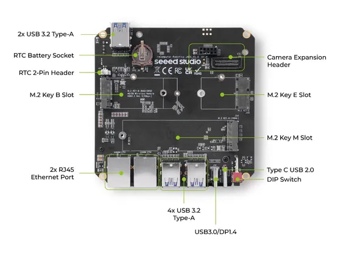
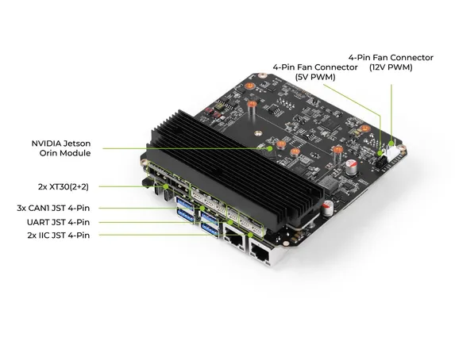

# reComputer Robotics J3010

**Seeed Studio** · Source collection

Revision: Unverified source identity  
Coverage: Source collection; review pending

[Browse all manufacturers](../../../../BROWSE.md) · [Desktop app](https://github.com/valleytechsolutions/black-wire-desktop)

## Hardware Overview (Front)

**source reference** · Unreviewed source · JPG

[Open original reference](../../../../library/media/c8f78260211d07f820b7523e7c7608ccc20743e16fdfc47677e138ca449e7bc4.jpg)

**Credit and rights:** Source rights not yet established. Source/manufacturer: Seeed Studio.

Original source index: Hardware Overview (Front). This file is searchable but has not been promoted to a reviewed physical board pinout.

SHA-256: `c8f78260211d07f820b7523e7c7608ccc20743e16fdfc47677e138ca449e7bc4`

## Hardware Overview (Top)

**source reference** · Unreviewed source · JPG

[Open original reference](../../../../library/media/53ba94e68872cad8835a46cc70d54723257f02b6e386ea536b92b2decddc7494.jpg)

**Credit and rights:** Source rights not yet established. Source/manufacturer: Seeed Studio.

Original source index: Hardware Overview (Top). This file is searchable but has not been promoted to a reviewed physical board pinout.

SHA-256: `53ba94e68872cad8835a46cc70d54723257f02b6e386ea536b92b2decddc7494`

## Hardware Overview

**source reference** · Unreviewed source · JPG

[Open original reference](../../../../library/media/b6f6da22bf48e3051394e87c00681cc09f45e740ffccb40b79ee0621550fdc5e.jpg)

**Credit and rights:** Source rights not yet established. Source/manufacturer: Seeed Studio.

Original source index: Hardware Overview. This file is searchable but has not been promoted to a reviewed physical board pinout.

SHA-256: `b6f6da22bf48e3051394e87c00681cc09f45e740ffccb40b79ee0621550fdc5e`

Pin assignments have not been independently electrically verified. Check board revision before wiring.
