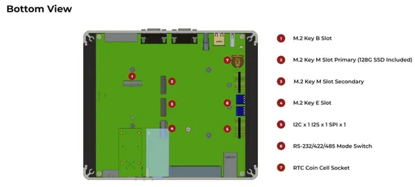
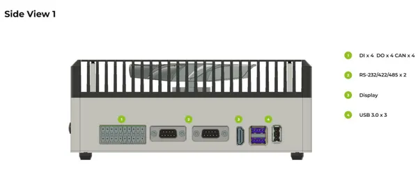
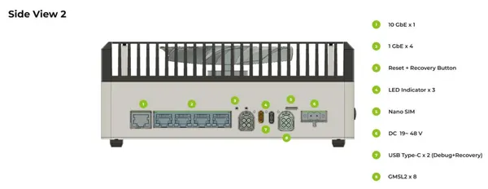
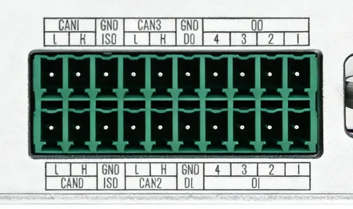
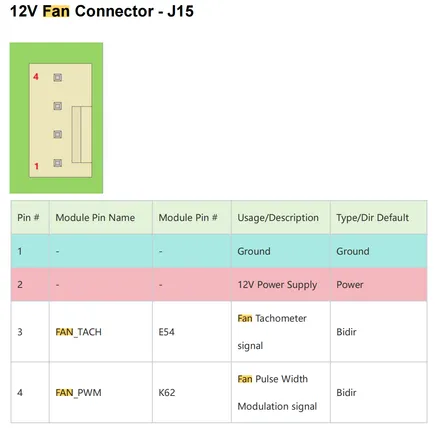
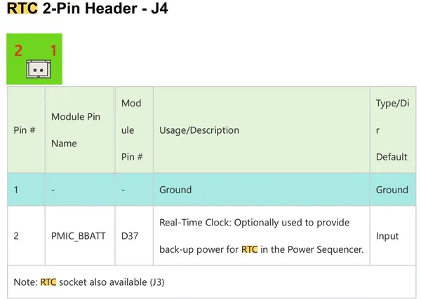

# reComputer Robotics J501

**Seeed Studio** · Source collection

Revision: Unverified source identity  
Coverage: Source collection; review pending

[Browse all manufacturers](../../../../BROWSE.md) · [Desktop app](https://github.com/valleytechsolutions/black-wire-desktop)

## Hardware Overview (Bottom)

**source reference** · Unreviewed source · PNG

[Open original reference](../../../../library/media/2323e96e70c8c7df90f05151c09d90d1cf45355ff581f4936d6f34275967f2e8.png)

**Credit and rights:** Source rights not yet established. Source/manufacturer: Seeed Studio.

Original source index: Hardware Overview (Bottom). This file is searchable but has not been promoted to a reviewed physical board pinout.

SHA-256: `2323e96e70c8c7df90f05151c09d90d1cf45355ff581f4936d6f34275967f2e8`

## Hardware Overview (Side 1)

**source reference** · Unreviewed source · PNG

[Open original reference](../../../../library/media/3759606a355d65db8d2bf5f398cfb38ba9c3afa1820a16a9b6f79f3e3644e24e.png)

**Credit and rights:** Source rights not yet established. Source/manufacturer: Seeed Studio.

Original source index: Hardware Overview (Side 1). This file is searchable but has not been promoted to a reviewed physical board pinout.

SHA-256: `3759606a355d65db8d2bf5f398cfb38ba9c3afa1820a16a9b6f79f3e3644e24e`

## Hardware Overview (Side 2)

**source reference** · Unreviewed source · PNG

[Open original reference](../../../../library/media/23ff154d63a59e923f8892375d57a34908ac8832328d769b565f6280fbfe9ea0.png)

**Credit and rights:** Source rights not yet established. Source/manufacturer: Seeed Studio.

Original source index: Hardware Overview (Side 2). This file is searchable but has not been promoted to a reviewed physical board pinout.

SHA-256: `23ff154d63a59e923f8892375d57a34908ac8832328d769b565f6280fbfe9ea0`

## Pin Definition Table (CAN-DI-DO Terminal Block)

**source reference** · Unreviewed source · PNG

[Open original reference](../../../../library/media/965b52529edeb43cbe96601739c42a068a948f5880eb5d9d1335d7d963c53a75.png)

**Credit and rights:** Source rights not yet established. Source/manufacturer: Seeed Studio.

[Source 1](https://files.seeedstudio.com/wiki/recomputer_robotic_j501/can_hw_1.png) · [Source 2](https://wiki.seeedstudio.com/ai_robotics_recomputer_j501_robotics_getting_started/)

Original source index: Pin Definition Table (CAN-DI-DO Terminal Block). This file is searchable but has not been promoted to a reviewed physical board pinout.

SHA-256: `965b52529edeb43cbe96601739c42a068a948f5880eb5d9d1335d7d963c53a75`

## Pin Definition Table (Fan Connector)

**source reference** · Unreviewed source · PNG

[Open original reference](../../../../library/media/7e2cb2c6740dbd3974a10e574f368944b394a81a6aeea91c4a731e90dc50f2a8.png)

**Credit and rights:** Source rights not yet established. Source/manufacturer: Seeed Studio.

Original source index: Pin Definition Table (Fan Connector). This file is searchable but has not been promoted to a reviewed physical board pinout.

SHA-256: `7e2cb2c6740dbd3974a10e574f368944b394a81a6aeea91c4a731e90dc50f2a8`

## Pin Definition Table (RTC Header)

**source reference** · Unreviewed source · PNG

[Open original reference](../../../../library/media/3c548bff7d1a0aa61827bc4175a4e09db00c5207821a243b06529202180b1106.png)

**Credit and rights:** Source rights not yet established. Source/manufacturer: Seeed Studio.

Original source index: Pin Definition Table (RTC Header). This file is searchable but has not been promoted to a reviewed physical board pinout.

SHA-256: `3c548bff7d1a0aa61827bc4175a4e09db00c5207821a243b06529202180b1106`

Pin assignments have not been independently electrically verified. Check board revision before wiring.
