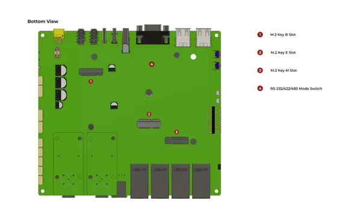
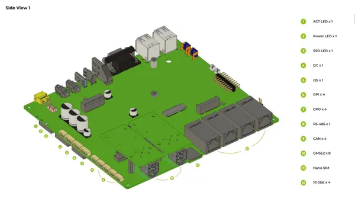
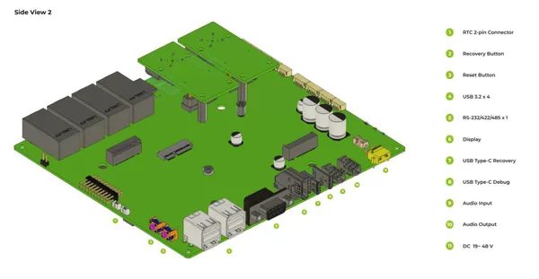

# reComputer Robotics J601

**Seeed Studio** · Source collection

Revision: Unverified source identity  
Coverage: Source collection; review pending

[Browse all manufacturers](../../../../BROWSE.md) · [Desktop app](https://github.com/valleytechsolutions/black-wire-desktop)

## Hardware Overview (Bottom)

**source reference** · Unreviewed source · JPG

[Open original reference](../../../../library/media/fbd93ca6587e94ceaae2d4c3fb702044841b97ba3dbd31a2f4b095d8e4a84426.jpg)

**Credit and rights:** Source rights not yet established. Source/manufacturer: Seeed Studio.

Original source index: Hardware Overview (Bottom). This file is searchable but has not been promoted to a reviewed physical board pinout.

SHA-256: `fbd93ca6587e94ceaae2d4c3fb702044841b97ba3dbd31a2f4b095d8e4a84426`

## Hardware Overview (Side 1)

**source reference** · Unreviewed source · PNG

[Open original reference](../../../../library/media/41073a28131edd3b7e95f5651e56c5bc20e95699244c0ea8795acf5acb3a6b43.png)

**Credit and rights:** Source rights not yet established. Source/manufacturer: Seeed Studio.

Original source index: Hardware Overview (Side 1). This file is searchable but has not been promoted to a reviewed physical board pinout.

SHA-256: `41073a28131edd3b7e95f5651e56c5bc20e95699244c0ea8795acf5acb3a6b43`

## Hardware Overview (Side 2)

**source reference** · Unreviewed source · PNG

[Open original reference](../../../../library/media/f48d8020075822243205bae2389f195ae1a1e0bb44518ece1030f4e9c7abc894.png)

**Credit and rights:** Source rights not yet established. Source/manufacturer: Seeed Studio.

Original source index: Hardware Overview (Side 2). This file is searchable but has not been promoted to a reviewed physical board pinout.

SHA-256: `f48d8020075822243205bae2389f195ae1a1e0bb44518ece1030f4e9c7abc894`

Pin assignments have not been independently electrically verified. Check board revision before wiring.
