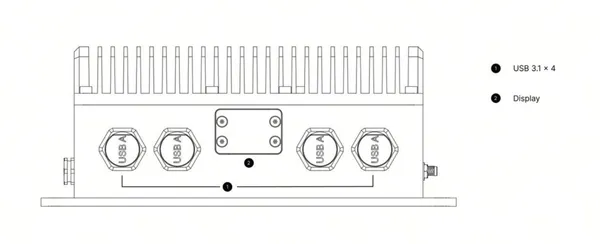
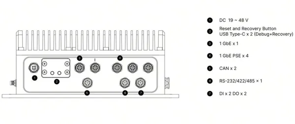
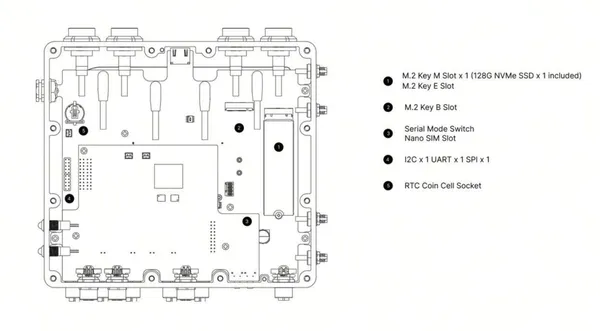
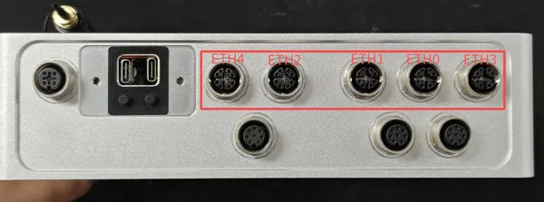

# reComputer Rugged J401

**Seeed Studio** · Source collection

Revision: Unverified source identity  
Coverage: Source collection; review pending

[Browse all manufacturers](../../../../BROWSE.md) · [Desktop app](https://github.com/valleytechsolutions/black-wire-desktop)

## Hardware Overview (Back)

**source reference** · Unreviewed source · PNG

[Open original reference](../../../../library/media/c7d6ec2ac10b02850c2aaee7d603b0bff647e6741a36213d0225808d973efea4.png)

**Credit and rights:** Source rights not yet established. Source/manufacturer: Seeed Studio.

Original source index: Hardware Overview (Back). This file is searchable but has not been promoted to a reviewed physical board pinout.

SHA-256: `c7d6ec2ac10b02850c2aaee7d603b0bff647e6741a36213d0225808d973efea4`

## Hardware Overview (Front)

**source reference** · Unreviewed source · PNG

[Open original reference](../../../../library/media/988ee5a55d229120954499f76ed28195022bc75f9da2e6d4bcb8a1def3641386.png)

**Credit and rights:** Source rights not yet established. Source/manufacturer: Seeed Studio.

Original source index: Hardware Overview (Front). This file is searchable but has not been promoted to a reviewed physical board pinout.

SHA-256: `988ee5a55d229120954499f76ed28195022bc75f9da2e6d4bcb8a1def3641386`

## Hardware Overview (Inside)

**source reference** · Unreviewed source · PNG

[Open original reference](../../../../library/media/3d09100a91f570e12771175617c6913a3cc573fc2372dfc2d96a55b1e3238f10.png)

**Credit and rights:** Source rights not yet established. Source/manufacturer: Seeed Studio.

Original source index: Hardware Overview (Inside). This file is searchable but has not been promoted to a reviewed physical board pinout.

SHA-256: `3d09100a91f570e12771175617c6913a3cc573fc2372dfc2d96a55b1e3238f10`

## Hardware Overview (Ports)

**source reference** · Unreviewed source · PNG

[Open original reference](../../../../library/media/da4083622ec060491040f71fe7b0a0e878b67a18af1531cdbc0aaa9f6ec0ff52.png)

**Credit and rights:** Source rights not yet established. Source/manufacturer: Seeed Studio.

[Source 1](https://files.seeedstudio.com/wiki/jetson/rugged-ethernet-Interface.png) · [Source 2](https://wiki.seeedstudio.com/ai_robotics_recomputer_rugged_j401_hardware_and_interface_usage/)

Original source index: Hardware Overview (Ports). This file is searchable but has not been promoted to a reviewed physical board pinout.

SHA-256: `da4083622ec060491040f71fe7b0a0e878b67a18af1531cdbc0aaa9f6ec0ff52`

Pin assignments have not been independently electrically verified. Check board revision before wiring.
