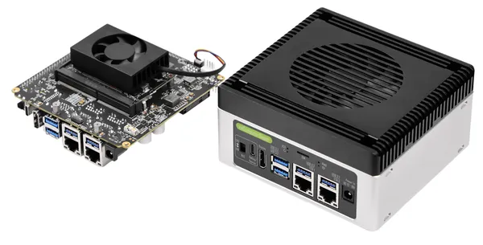

# reComputer Super J3011

**Seeed Studio** · Source collection

Revision: Unverified source identity  
Coverage: Source collection; review pending

[Browse all manufacturers](../../../../BROWSE.md) · [Desktop app](https://github.com/valleytechsolutions/black-wire-desktop)

## Hardware Overview

**source reference** · Unreviewed source · PNG

[Open original reference](../../../../library/media/58ba571ae110e9933b4c6d60262ce558fa9f93ad687aefcf5e7f64e0ecdcacb7.png)

**Credit and rights:** Source rights not yet established. Source/manufacturer: Seeed Studio.

Original source index: Hardware Overview. This file is searchable but has not been promoted to a reviewed physical board pinout.

SHA-256: `58ba571ae110e9933b4c6d60262ce558fa9f93ad687aefcf5e7f64e0ecdcacb7`

Pin assignments have not been independently electrically verified. Check board revision before wiring.
