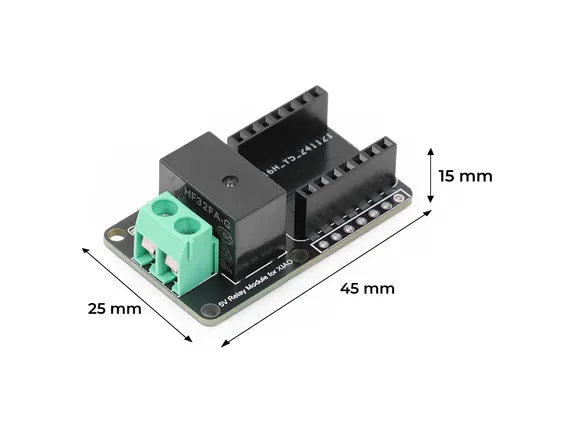

# Relay Add On Module for XIAO

**Seeed Studio** · Source collection

Revision: Unverified source identity  
Coverage: Source collection; review pending

[Browse all manufacturers](../../../../BROWSE.md) · [Desktop app](https://github.com/valleytechsolutions/black-wire-desktop)

## Dimensions

**source reference** · Unreviewed source · JPG

[Open original reference](../../../../library/media/42e5f0ee938b1c4cdf0e15fccf9bdc5ba5fa3b2bb1a52b2401da46720aef9531.jpg)

**Credit and rights:** Source rights not yet established. Source/manufacturer: Seeed Studio.

[Source 1](https://files.seeedstudio.com/wiki/XIAO/Gadgets/relay_module_for_xiao/13.jpg) · [Source 2](https://wiki.seeedstudio.com/relay_add_on_module_for_xiao/)

Original source index: Dimensions. This file is searchable but has not been promoted to a reviewed physical board pinout.

SHA-256: `42e5f0ee938b1c4cdf0e15fccf9bdc5ba5fa3b2bb1a52b2401da46720aef9531`

Pin assignments have not been independently electrically verified. Check board revision before wiring.
