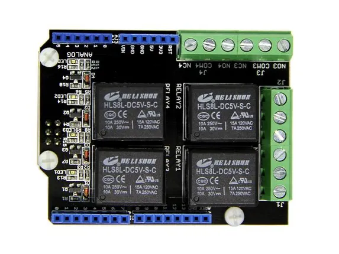
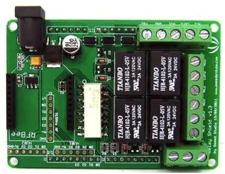

# Relay Shield

**Seeed Studio** · Source collection

Revision: Unverified source identity  
Coverage: Source collection; review pending

[Browse all manufacturers](../../../../BROWSE.md) · [Desktop app](https://github.com/valleytechsolutions/black-wire-desktop)

## Hardware Overview (Front) 2

**source reference** · Unreviewed source · JPG

[Open original reference](../../../../library/media/f75c9a71978a678e9bd5b59a516e91b0a85f118f29c9f8238a453b718688ed03.jpg)

**Credit and rights:** Source rights not yet established. Source/manufacturer: Seeed Studio.

[Source 1](https://files.seeedstudio.com/wiki/Relay-Shield/img/Relayshield_01.jpg) · [Source 2](https://wiki.seeedstudio.com/Relay_Shield/)

Original source index: Hardware Overview (Front) 2. This file is searchable but has not been promoted to a reviewed physical board pinout.

SHA-256: `f75c9a71978a678e9bd5b59a516e91b0a85f118f29c9f8238a453b718688ed03`

## Hardware Overview (Front)

**source reference** · Unreviewed source · JPG

[Open original reference](../../../../library/media/9de1764df6f651653695bca7e0c057c2da6eaec8f26367a6240303aa081f94aa.jpg)

**Credit and rights:** Source rights not yet established. Source/manufacturer: Seeed Studio.

[Source 1](https://files.seeedstudio.com/wiki/Relay-Shield/img/RelayShield.jpg) · [Source 2](https://wiki.seeedstudio.com/Relay_Shield/)

Original source index: Hardware Overview (Front). This file is searchable but has not been promoted to a reviewed physical board pinout.

SHA-256: `9de1764df6f651653695bca7e0c057c2da6eaec8f26367a6240303aa081f94aa`

Pin assignments have not been independently electrically verified. Check board revision before wiring.
