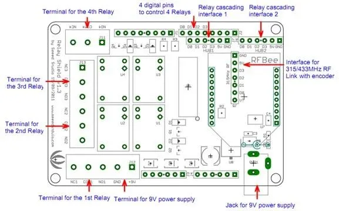

# Relay Shield V1.0

**Seeed Studio** · Source collection

Revision: Unverified source identity  
Coverage: Source collection; review pending

[Browse all manufacturers](../../../../BROWSE.md) · [Desktop app](https://github.com/valleytechsolutions/black-wire-desktop)

## Hardware Overview

**source reference** · Unreviewed source · JPG

[Open original reference](../../../../library/media/2148b94b1f4836e3fde4e219f0df523728084324562239aaaa4a72ef5c94513b.jpg)

**Credit and rights:** Source rights not yet established. Source/manufacturer: Seeed Studio.

[Source 1](https://files.seeedstudio.com/wiki/Relay-Shield_V1.0/img/Relayshield_schematic.jpg) · [Source 2](https://wiki.seeedstudio.com/Relay_Shield_V1/)

Original source index: Hardware Overview. This file is searchable but has not been promoted to a reviewed physical board pinout.

SHA-256: `2148b94b1f4836e3fde4e219f0df523728084324562239aaaa4a72ef5c94513b`

Pin assignments have not been independently electrically verified. Check board revision before wiring.
