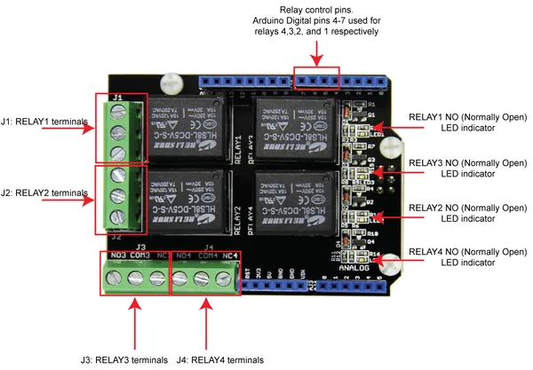

# Relay Shield V2.0

**Seeed Studio** · Source collection

Revision: Unverified source identity  
Coverage: Source collection; review pending

[Browse all manufacturers](../../../../BROWSE.md) · [Desktop app](https://github.com/valleytechsolutions/black-wire-desktop)

## Hardware Overview

**source reference** · Unreviewed source · PNG

[Open original reference](../../../../library/media/1ab61ef693559939d65cb15f58eb866e2a6fbbf679fb404f6fa9701f1ceb713d.png)

**Credit and rights:** Source rights not yet established. Source/manufacturer: Seeed Studio.

[Source 1](https://files.seeedstudio.com/wiki/Relay-Shield_V2.0/img/Relays-Shield-PCB-Explained-real.png) · [Source 2](https://wiki.seeedstudio.com/Relay_Shield_V2/)

Original source index: Hardware Overview. This file is searchable but has not been promoted to a reviewed physical board pinout.

SHA-256: `1ab61ef693559939d65cb15f58eb866e2a6fbbf679fb404f6fa9701f1ceb713d`

Pin assignments have not been independently electrically verified. Check board revision before wiring.
