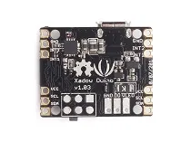

# RePhone Core 2G-Atmel32u4

**Seeed Studio** · Source collection

Revision: Unverified source identity  
Coverage: Source collection; review pending

[Browse all manufacturers](../../../../BROWSE.md) · [Desktop app](https://github.com/valleytechsolutions/black-wire-desktop)

## Pin Functions

**source reference** · Unreviewed source · JPG

[Open original reference](../../../../library/media/7b4031cb94ee99dc227fb8d4b0923c175497fa642256246da85f20e40dcbd083.jpg)

**Credit and rights:** Source rights not yet established. Source/manufacturer: Seeed Studio.

[Source 1](https://files.seeedstudio.com/wiki/Rephone/image/product9.jpg) · [Source 2](https://wiki.seeedstudio.com/RePhone/)

Original source index: Pin Functions. This file is searchable but has not been promoted to a reviewed physical board pinout.

SHA-256: `7b4031cb94ee99dc227fb8d4b0923c175497fa642256246da85f20e40dcbd083`

Pin assignments have not been independently electrically verified. Check board revision before wiring.
