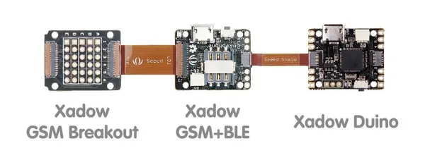

# RePhone Lumi Kit

**Seeed Studio** · Source collection

Revision: Unverified source identity  
Coverage: Source collection; review pending

[Browse all manufacturers](../../../../BROWSE.md) · [Desktop app](https://github.com/valleytechsolutions/black-wire-desktop)

## Block Diagram

**source reference** · Unreviewed source · JPG

[Open original reference](../../../../library/media/1513c2b01fe2783ae3f82785c1a56e6463cd33fe5c393a9174c683eae67370fb.jpg)

**Credit and rights:** Source rights not yet established. Source/manufacturer: Seeed Studio.

[Source 1](https://files.seeedstudio.com/wiki/RePhone_Lumi_Kit/img/RePhone_Lumi_Kit_wiki_2.jpg) · [Source 2](https://wiki.seeedstudio.com/RePhone_Lumi_Kit/)

Original source index: Block Diagram. This file is searchable but has not been promoted to a reviewed physical board pinout.

SHA-256: `1513c2b01fe2783ae3f82785c1a56e6463cd33fe5c393a9174c683eae67370fb`

Pin assignments have not been independently electrically verified. Check board revision before wiring.
