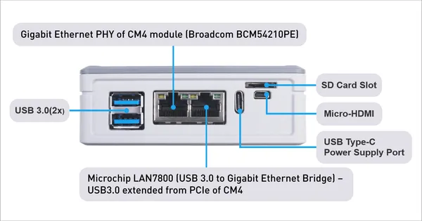

# reRouter CM4

**Seeed Studio** · Source collection

Revision: Unverified source identity  
Coverage: Source collection; review pending

[Browse all manufacturers](../../../../BROWSE.md) · [Desktop app](https://github.com/valleytechsolutions/black-wire-desktop)

## Hardware Overview (Ports)

**source reference** · Unreviewed source · PNG

[Open original reference](../../../../library/media/d9bda15d96336547f6755ffa5150046e682d2ea4172652a14acfe7bab2cc6bbc.png)

**Credit and rights:** Source rights not yet established. Source/manufacturer: Seeed Studio.

Original source index: Hardware Overview (Ports). This file is searchable but has not been promoted to a reviewed physical board pinout.

SHA-256: `d9bda15d96336547f6755ffa5150046e682d2ea4172652a14acfe7bab2cc6bbc`

Pin assignments have not been independently electrically verified. Check board revision before wiring.
