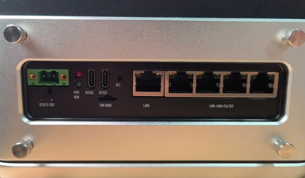
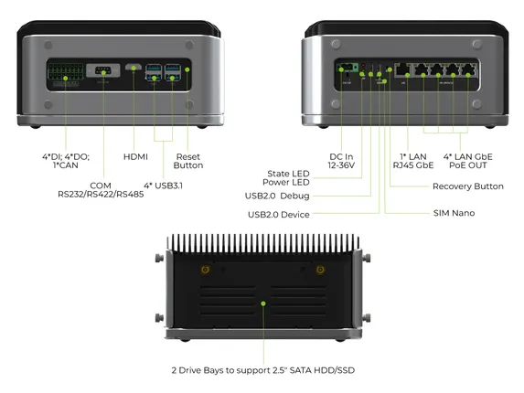
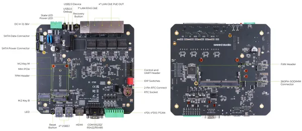

# reServer Industrial J2011

**Seeed Studio** · Source collection

Revision: Unverified source identity  
Coverage: Source collection; review pending

[Browse all manufacturers](../../../../BROWSE.md) · [Desktop app](https://github.com/valleytechsolutions/black-wire-desktop)

## Hardware Overview (Ports)

**source reference** · Unreviewed source · JPG

[Open original reference](../../../../library/media/fa4e9b96b82febfea6cd62cb074f2da723373df1dc9504045c08b0920e4012a5.jpg)

**Credit and rights:** Source rights not yet established. Source/manufacturer: Seeed Studio.

[Source 1](https://files.seeedstudio.com/wiki/reServer-Industrial/5.jpg) · [Source 2](https://wiki.seeedstudio.com/reserver_industrial_hardware_interface_usage/)

Original source index: Hardware Overview (Ports). This file is searchable but has not been promoted to a reviewed physical board pinout.

SHA-256: `fa4e9b96b82febfea6cd62cb074f2da723373df1dc9504045c08b0920e4012a5`

## Hardware Overview 2

**source reference** · Unreviewed source · JPG

[Open original reference](../../../../library/media/c66771cf29453c55facb36485e1a7f1aea47226c55c3c867668c8340284ea371.jpg)

**Credit and rights:** Source rights not yet established. Source/manufacturer: Seeed Studio.

Original source index: Hardware Overview 2. This file is searchable but has not been promoted to a reviewed physical board pinout.

SHA-256: `c66771cf29453c55facb36485e1a7f1aea47226c55c3c867668c8340284ea371`

## Hardware Overview

**source reference** · Unreviewed source · JPG

[Open original reference](../../../../library/media/e489182385e485ac95ed3734398a7cc2bdffc25a35fdf876d8b180d69ceb463f.jpg)

**Credit and rights:** Source rights not yet established. Source/manufacturer: Seeed Studio.

Original source index: Hardware Overview. This file is searchable but has not been promoted to a reviewed physical board pinout.

SHA-256: `e489182385e485ac95ed3734398a7cc2bdffc25a35fdf876d8b180d69ceb463f`

Pin assignments have not been independently electrically verified. Check board revision before wiring.
