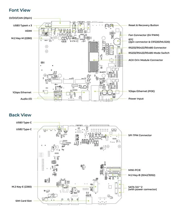

# reServer J501

**Seeed Studio** · Source collection

Revision: Unverified source identity  
Coverage: Source collection; review pending

[Browse all manufacturers](../../../../BROWSE.md) · [Desktop app](https://github.com/valleytechsolutions/black-wire-desktop)

## Hardware Overview

**source reference** · Unreviewed source · JPG

[Open original reference](../../../../library/media/553214bbf3fdd68edd2f8b9a94c3cfae2d78f3070b177d7a02db37288471e274.jpg)

**Credit and rights:** Source rights not yet established. Source/manufacturer: Seeed Studio.

Original source index: Hardware Overview. This file is searchable but has not been promoted to a reviewed physical board pinout.

SHA-256: `553214bbf3fdd68edd2f8b9a94c3cfae2d78f3070b177d7a02db37288471e274`

Pin assignments have not been independently electrically verified. Check board revision before wiring.
