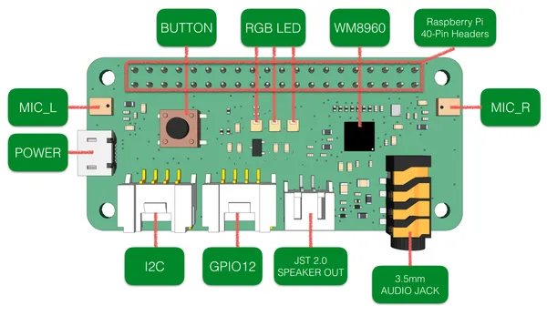
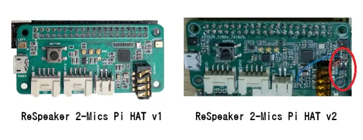

# reSpeaker 2-Mics Pi HAT

**Seeed Studio** · Source collection

Revision: Unverified source identity  
Coverage: Source collection; review pending

[Browse all manufacturers](../../../../BROWSE.md) · [Desktop app](https://github.com/valleytechsolutions/black-wire-desktop)

## Hardware Overview

**source reference** · Unreviewed source · PNG

[Open original reference](../../../../library/media/e81d0ed9491e01e318334b90e7091f1ac90deda86dcccb8915584584eccdc13a.png)

**Credit and rights:** Source rights not yet established. Source/manufacturer: Seeed Studio.

[Source 1](https://files.seeedstudio.com/wiki/MIC_HATv1.0_for_raspberrypi/img/mic_hatv1.0.png) · [Source 2](https://wiki.seeedstudio.com/ReSpeaker_2_Mics_Pi_HAT/)

Original source index: Hardware Overview. This file is searchable but has not been promoted to a reviewed physical board pinout.

SHA-256: `e81d0ed9491e01e318334b90e7091f1ac90deda86dcccb8915584584eccdc13a`

## Hardware Overview

**source reference** · Unreviewed source · WEBP

[Open original reference](../../../../library/media/34d5a5330be4289e8ff9871742594431ccd863b2ae1b3ae0d4b6529fa568af22.webp)

**Credit and rights:** Source rights not yet established. Source/manufacturer: Seeed Studio.

[Source 1](https://files.seeedstudio.com/wiki/ReSpeaker_2_Mics_Pi_HAT/v2/pcn.webp) · [Source 2](https://wiki.seeedstudio.com/how-to-distinguish-respeaker_2-mics_pi_hat-hardware-revisions/)

Original source index: Hardware Overview. This file is searchable but has not been promoted to a reviewed physical board pinout.

SHA-256: `34d5a5330be4289e8ff9871742594431ccd863b2ae1b3ae0d4b6529fa568af22`

Pin assignments have not been independently electrically verified. Check board revision before wiring.
