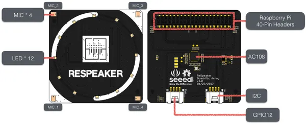

# reSpeaker 4-Mic Array for Raspberry Pi

**Seeed Studio** · Source collection

Revision: Unverified source identity  
Coverage: Source collection; review pending

[Browse all manufacturers](../../../../BROWSE.md) · [Desktop app](https://github.com/valleytechsolutions/black-wire-desktop)

## Hardware Overview

**source reference** · Unreviewed source · PNG

[Open original reference](../../../../library/media/d9ec67c85e80196861669cdd9c3a1c4f43e7727c53992d58b4797c0e0a4a1935.png)

**Credit and rights:** Source rights not yet established. Source/manufacturer: Seeed Studio.

[Source 1](https://files.seeedstudio.com/wiki/ReSpeaker-4-Mic-Array-for-Raspberry-Pi/img/features.png) · [Source 2](https://wiki.seeedstudio.com/ReSpeaker_4_Mic_Array_for_Raspberry_Pi/)

Original source index: Hardware Overview. This file is searchable but has not been promoted to a reviewed physical board pinout.

SHA-256: `d9ec67c85e80196861669cdd9c3a1c4f43e7727c53992d58b4797c0e0a4a1935`

Pin assignments have not been independently electrically verified. Check board revision before wiring.
