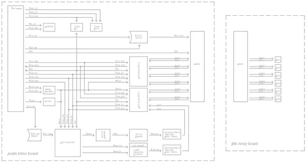
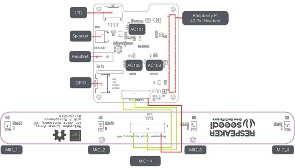

# reSpeaker 4-Mic Linear Array Kit for Raspberry Pi

**Seeed Studio** · Source collection

Revision: Unverified source identity  
Coverage: Source collection; review pending

[Browse all manufacturers](../../../../BROWSE.md) · [Devices & IoT](../../../../DEVICES.md) · [Open in the browser guide](https://valleytech-black-wire-guide.pages.dev/?board=source-board-e9e6dfdd8e5811d456)

Device category: **Cameras & audio**

## Block Diagram

**source reference** · Unreviewed source · PNG

[Open original reference](../../../../library/media/adc572c39b1a22e7e8fad0182d98afcb7dbf191ecbcbd5ad437c2d71884c1510.png)

**Credit and rights:** Source rights not yet established. Source/manufacturer: Seeed Studio.

[Source 1](https://files.seeedstudio.com/wiki/ReSpeaker_4-Mics_Linear_Array_Kit/img/voice_hat_acc-correct.png) · [Source 2](https://wiki.seeedstudio.com/ReSpeaker_4-Mic_Linear_Array_Kit_for_Raspberry_Pi/)

Original source index: Block Diagram. This file is searchable but has not been promoted to a reviewed physical board pinout.

Image revision: Not identified

SHA-256: `adc572c39b1a22e7e8fad0182d98afcb7dbf191ecbcbd5ad437c2d71884c1510`

## Hardware Overview

**source reference** · Unreviewed source · JPG

[Open original reference](../../../../library/media/1d4f5230b02d521d9ee3b9a30ba5f88c43641ae8656968333e068c26ae137cf6.jpg)

**Credit and rights:** Source rights not yet established. Source/manufacturer: Seeed Studio.

[Source 1](https://files.seeedstudio.com/wiki/ReSpeaker_4-Mics_Linear_Array_Kit/img/Hardware.jpg) · [Source 2](https://wiki.seeedstudio.com/ReSpeaker_4-Mic_Linear_Array_Kit_for_Raspberry_Pi/)

Original source index: Hardware Overview. This file is searchable but has not been promoted to a reviewed physical board pinout.

Image revision: Not identified

SHA-256: `1d4f5230b02d521d9ee3b9a30ba5f88c43641ae8656968333e068c26ae137cf6`

Pin assignments have not been independently electrically verified. Check board revision before wiring.
