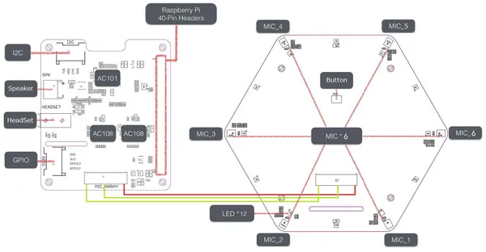

# reSpeaker 6-Mic Circular Array Kit for Raspberry Pi

**Seeed Studio** · Source collection

Revision: Unverified source identity  
Coverage: Source collection; review pending

[Browse all manufacturers](../../../../BROWSE.md) · [Desktop app](https://github.com/valleytechsolutions/black-wire-desktop)

## Hardware Overview

**source reference** · Unreviewed source · JPG

[Open original reference](../../../../library/media/9ef3f7d29190d628c3a661fd9e6c90f0936561c15a10bf84d19ca40b74e78dcc.jpg)

**Credit and rights:** Source rights not yet established. Source/manufacturer: Seeed Studio.

[Source 1](https://files.seeedstudio.com/wiki/ReSpeaker_6-Mics_Circular_Array_kit_for_Raspberry_Pi/img/hardware.jpg) · [Source 2](https://wiki.seeedstudio.com/ReSpeaker_6-Mic_Circular_Array_kit_for_Raspberry_Pi/)

Original source index: Hardware Overview. This file is searchable but has not been promoted to a reviewed physical board pinout.

SHA-256: `9ef3f7d29190d628c3a661fd9e6c90f0936561c15a10bf84d19ca40b74e78dcc`

Pin assignments have not been independently electrically verified. Check board revision before wiring.
