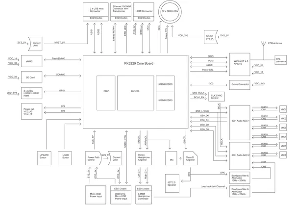
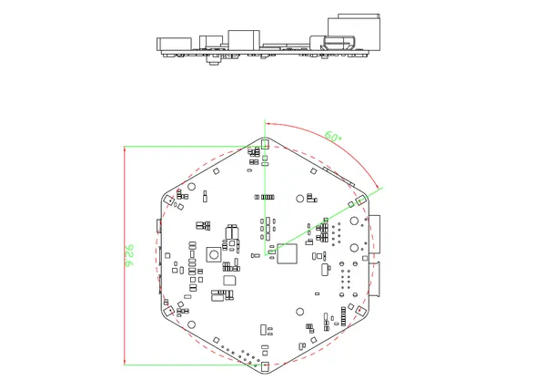
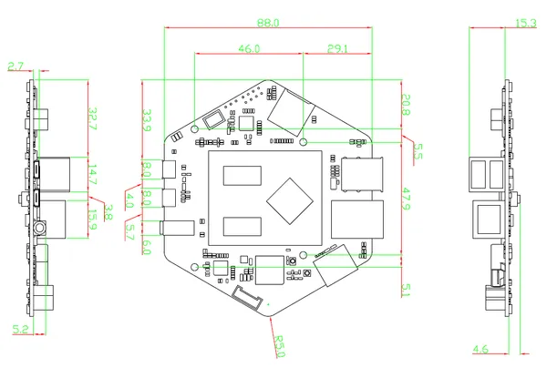
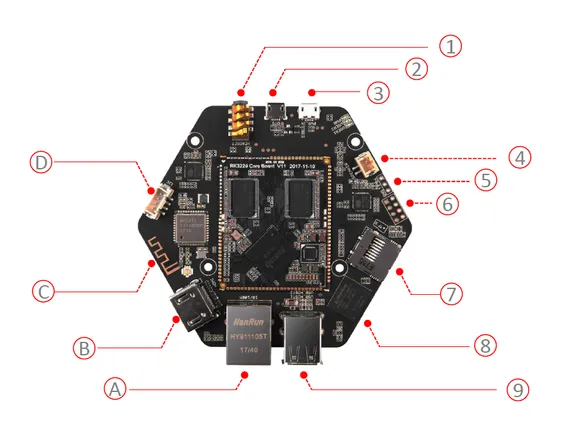
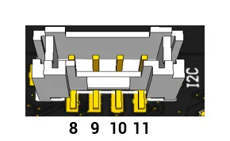
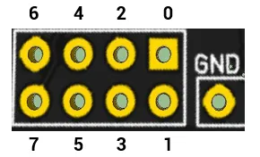

# reSpeaker Core V2.0

**Seeed Studio** · Source collection

Revision: Unverified source identity  
Coverage: Source collection; review pending

[Browse all manufacturers](../../../../BROWSE.md) · [Desktop app](https://github.com/valleytechsolutions/black-wire-desktop)

## Block Diagram

**source reference** · Unreviewed source · PNG

[Open original reference](../../../../library/media/3afd56025514956206e10ee96baebf6251df12c1dfd483b8887952c31ed7a2c9.png)

**Credit and rights:** Source rights not yet established. Source/manufacturer: Seeed Studio.

[Source 1](https://files.seeedstudio.com/wiki/Respeaker_V2/img/SYS.png) · [Source 2](https://wiki.seeedstudio.com/ReSpeaker_Core_v2.0/)

Original source index: Block Diagram. This file is searchable but has not been promoted to a reviewed physical board pinout.

SHA-256: `3afd56025514956206e10ee96baebf6251df12c1dfd483b8887952c31ed7a2c9`

## Dimensions 2

**source reference** · Unreviewed source · PNG

[Open original reference](../../../../library/media/04c4143f418630f6622a57c9c228c074d78bb2e7f0234d2623f5c9520a9d223b.png)

**Credit and rights:** Source rights not yet established. Source/manufacturer: Seeed Studio.

[Source 1](https://files.seeedstudio.com/wiki/Respeaker_V2/img/Dimension_1.png) · [Source 2](https://wiki.seeedstudio.com/ReSpeaker_Core_v2.0/)

Original source index: Dimensions 2. This file is searchable but has not been promoted to a reviewed physical board pinout.

SHA-256: `04c4143f418630f6622a57c9c228c074d78bb2e7f0234d2623f5c9520a9d223b`

## Dimensions

**source reference** · Unreviewed source · PNG

[Open original reference](../../../../library/media/9812480249928a68a2482a6417fd95b716b1f4dbefb35f87cb86f59336b1420a.png)

**Credit and rights:** Source rights not yet established. Source/manufacturer: Seeed Studio.

[Source 1](https://files.seeedstudio.com/wiki/Respeaker_V2/img/Dimension_2.png) · [Source 2](https://wiki.seeedstudio.com/ReSpeaker_Core_v2.0/)

Original source index: Dimensions. This file is searchable but has not been promoted to a reviewed physical board pinout.

SHA-256: `9812480249928a68a2482a6417fd95b716b1f4dbefb35f87cb86f59336b1420a`

## Hardware Overview (Front)

**source reference** · Unreviewed source · PNG

[Open original reference](../../../../library/media/63cdb840a7280d51655d7127cd91320d35895c1a8c657b7ea6419d9c9afb8590.png)

**Credit and rights:** Source rights not yet established. Source/manufacturer: Seeed Studio.

[Source 1](https://files.seeedstudio.com/wiki/Respeaker_V2/img/hardware_overview.png) · [Source 2](https://wiki.seeedstudio.com/ReSpeaker_Core_v2.0/)

Original source index: Hardware Overview (Front). This file is searchable but has not been promoted to a reviewed physical board pinout.

SHA-256: `63cdb840a7280d51655d7127cd91320d35895c1a8c657b7ea6419d9c9afb8590`

## Pin Definition Table 2

**source reference** · Unreviewed source · PNG

[Open original reference](../../../../library/media/9b12ae1c6620c12bf7ea48f728bceb92458e48c70cd91d45a4999db456493c13.png)

**Credit and rights:** Source rights not yet established. Source/manufacturer: Seeed Studio.

[Source 1](https://files.seeedstudio.com/wiki/Respeaker_V2/img/socketBLACK.png) · [Source 2](https://wiki.seeedstudio.com/ReSpeaker_Core_v2.0/)

Original source index: Pin Definition Table 2. This file is searchable but has not been promoted to a reviewed physical board pinout.

SHA-256: `9b12ae1c6620c12bf7ea48f728bceb92458e48c70cd91d45a4999db456493c13`

## Pin Definition Table

**source reference** · Unreviewed source · PNG

[Open original reference](../../../../library/media/1664e304c5619a8a5f88b71a92d3e59adfd8c62fc3893f83a1a2b6b2631f4e26.png)

**Credit and rights:** Source rights not yet established. Source/manufacturer: Seeed Studio.

[Source 1](https://files.seeedstudio.com/wiki/Respeaker_V2/img/GPIO.png) · [Source 2](https://wiki.seeedstudio.com/ReSpeaker_Core_v2.0/)

Original source index: Pin Definition Table. This file is searchable but has not been promoted to a reviewed physical board pinout.

SHA-256: `1664e304c5619a8a5f88b71a92d3e59adfd8c62fc3893f83a1a2b6b2631f4e26`

Pin assignments have not been independently electrically verified. Check board revision before wiring.
