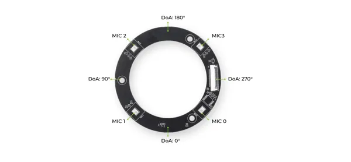
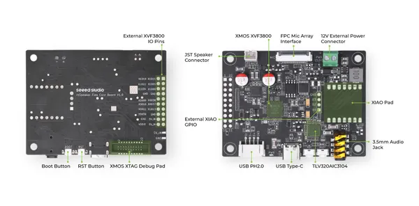

# reSpeaker Flex Circular Mic Array

**Seeed Studio** · Source collection

Revision: Unverified source identity  
Coverage: Source collection; review pending

[Browse all manufacturers](../../../../BROWSE.md) · [Devices & IoT](../../../../DEVICES.md) · [Open in the browser guide](https://valleytech-black-wire-guide.pages.dev/?board=source-board-aa6405f26a11fada29)

Device category: **Cameras & audio**

## Hardware Overview 2

**source reference** · Unreviewed source · JPG

[Open original reference](../../../../library/media/495b34c8a6f1e1f11a47a6546116ef0098208b9e3af627ebe2ad4a4418359bd1.jpg)

**Credit and rights:** Source rights not yet established. Source/manufacturer: Seeed Studio.

[Source 1](https://files.seeedstudio.com/wiki/reSpeaker_flex/flex_doa.jpg) · [Source 2](https://wiki.seeedstudio.com/respeaker_flex_introduction/)

Original source index: Hardware Overview 2. This file is searchable but has not been promoted to a reviewed physical board pinout.

Image revision: Not identified

SHA-256: `495b34c8a6f1e1f11a47a6546116ef0098208b9e3af627ebe2ad4a4418359bd1`

## Hardware Overview

**source reference** · Unreviewed source · JPG

[Open original reference](../../../../library/media/6f57a3dd6968b1f5365422a79af858e9372cf1d9bbbd399a7716946f6acc2cbe.jpg)

**Credit and rights:** Source rights not yet established. Source/manufacturer: Seeed Studio.

[Source 1](https://files.seeedstudio.com/wiki/reSpeaker_flex/main_noxiao.jpg) · [Source 2](https://wiki.seeedstudio.com/respeaker_flex_introduction/)

Original source index: Hardware Overview. This file is searchable but has not been promoted to a reviewed physical board pinout.

Image revision: Not identified

SHA-256: `6f57a3dd6968b1f5365422a79af858e9372cf1d9bbbd399a7716946f6acc2cbe`

Pin assignments have not been independently electrically verified. Check board revision before wiring.
