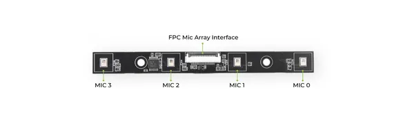

# reSpeaker Flex Linear Mic Array

**Seeed Studio** · Source collection

Revision: Unverified source identity  
Coverage: Source collection; review pending

[Browse all manufacturers](../../../../BROWSE.md) · [Devices & IoT](../../../../DEVICES.md) · [Open in the browser guide](https://valleytech-black-wire-guide.pages.dev/?board=source-board-6cff07730366ff4b43)

Device category: **Cameras & audio**

## Hardware Overview 2

**source reference** · Unreviewed source · JPG

[Open original reference](../../../../library/media/5d8fc00874175d14efbb5da50e5de119dd96b9873c4aea4c8ecefda69957ddbd.jpg)

**Credit and rights:** Source rights not yet established. Source/manufacturer: Seeed Studio.

[Source 1](https://files.seeedstudio.com/wiki/reSpeaker_flex/flex_linear.jpg) · [Source 2](https://wiki.seeedstudio.com/respeaker_flex_introduction/)

Original source index: Hardware Overview 2. This file is searchable but has not been promoted to a reviewed physical board pinout.

Image revision: Not identified

SHA-256: `5d8fc00874175d14efbb5da50e5de119dd96b9873c4aea4c8ecefda69957ddbd`

Pin assignments have not been independently electrically verified. Check board revision before wiring.
